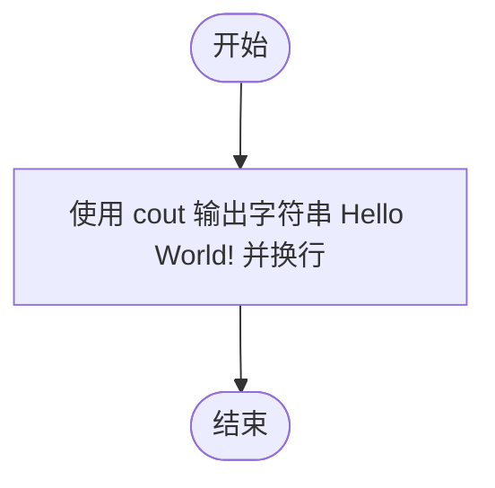
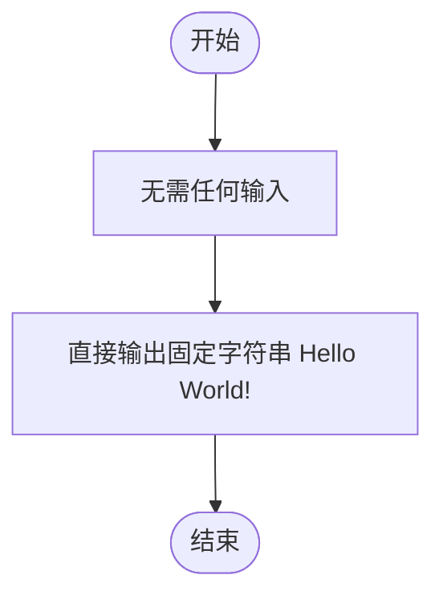

# L1-001 - Hello World（5 分）

- **时间限制**: 400 ms
- **内存限制**: 65536 KB
- **代码长度限制**: 16 KB

---

## 题目描述

这道超级简单的题目没有任何输入。

你只需要在一行中输出著名短句“Hello World!”就可以了。

### 输入样例:
```in
无
```

### 输出样例:
```out
Hello World!
```

## 示例

### 示例 1

**输入:**
```
无
```

**输出:**
```
Hello World!
```

---

## 题目详解

### 一、解题思路

这是一道最简单的输出题，没有任何输入。只需要在 `main` 函数中调用 `cout` 将固定字符串 `Hello World!` 输出到标准输出，并换行即可，无需任何算法与数据处理。

### 二、代码流程说明

1. 包含头文件 `<iostream>` 并使用 `namespace std` 简化写法。
2. `main` 函数开始执行。
3. 使用 `cout << "Hello World!" << endl;` 输出字符串 `Hello World!` 并换行。
4. 执行 `return 0;` 正常结束程序。

### 三、代码流程图



### 四、解题流程图


