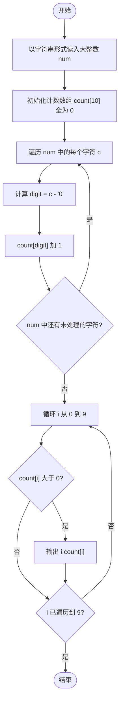
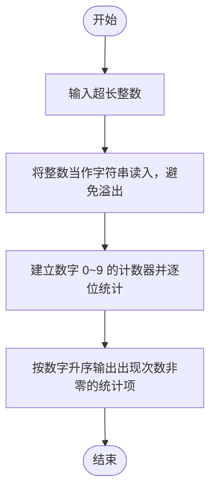

# L1-003 - 个位数统计（15 分）

- **时间限制**: 400 ms
- **内存限制**: 65536 KB
- **代码长度限制**: 16 KB

---

## 题目描述

给定一个 $$k$$ 位整数 $$N = d_{k-1}10^{k-1} + \cdots + d_1 10^1 + d_0$$ ($$0\le d_i \le 9$$, $$i=0,\cdots ,k-1$$, $$d_{k-1}>0$$)，请编写程序统计每种不同的个位数字出现的次数。例如：给定 $$N = 100311$$，则有 2 个 0，3 个 1，和 1 个 3。

### 输入格式:

每个输入包含 1 个测试用例，即一个不超过 1000 位的正整数 $$N$$。

### 输出格式:

对 $$N$$ 中每一种不同的个位数字，以 `D:M` 的格式在一行中输出该位数字 `D` 及其在 $$N$$ 中出现的次数 `M`。要求按 `D` 的升序输出。

### 输入样例:
```in
100311
```

### 输出样例:
```out
0:2
1:3
3:1
```

## 示例

### 示例 1

**输入:**
```
100311
```

**输出:**
```
0:2
1:3
3:1
```

---

## 题目详解

### 一、解题思路

输入的正整数最多可达 1000 位，远超 `long long` 的表示范围，因此不能当作整数读入，而是将输入视为**字符串**逐位处理。

算法步骤：

1. 用字符串 `num` 读入大整数。
2. 建立长度为 10 的计数数组 `count`，`count[i]` 表示数字 `i`（0~9）出现的次数，初始全为 0。
3. 遍历字符串的每个字符 `c`，通过 `c - '0'` 把字符转换为对应数字索引，并将该数字的计数加 1。
4. 按数字 `0` 到 `9` 的升序，只输出出现次数大于 0 的项，格式为 `D:M`。

### 二、代码流程说明

1. 用 `string num` 读入大整数（按字符串处理）。
2. 初始化计数数组 `int count[10] = {0}`。
3. 遍历 `num` 中的每个字符 `c`：
   - 计算 `digit = c - '0'` 得到对应数字；
   - 执行 `count[digit]++` 累加计数。
4. 循环 `i` 从 0 到 9：若 `count[i] > 0`，输出 `i:count[i]` 并换行。
5. 执行 `return 0` 结束程序。

### 三、代码流程图



### 四、解题流程图


