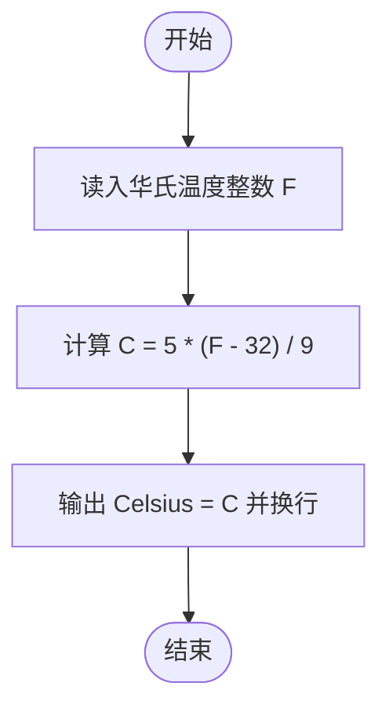
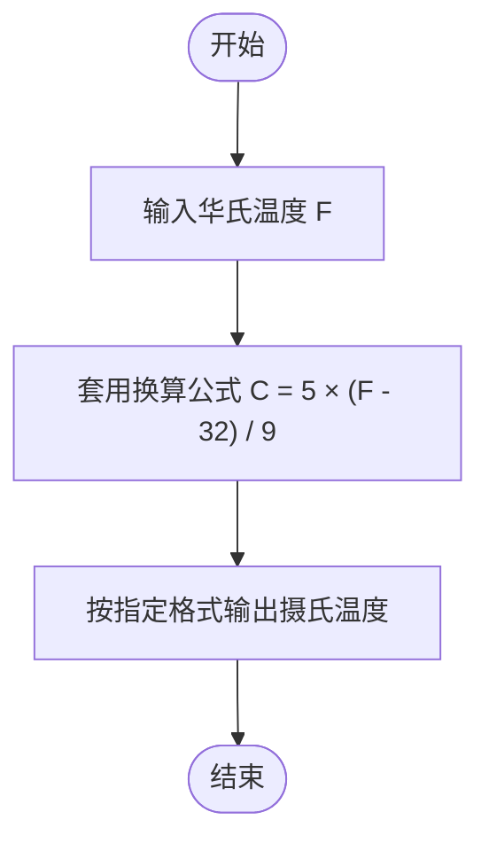

# L1-004 - 计算摄氏温度（5 分）

- **时间限制**: 400 ms
- **内存限制**: 65536 KB
- **代码长度限制**: 16 KB

---

## 题目描述

给定一个华氏温度$$F$$，本题要求编写程序，计算对应的摄氏温度$$C$$。计算公式：$$C = 5\times (F-32)/9$$。题目保证输入与输出均在整型范围内。

### 输入格式:

输入在一行中给出一个华氏温度。

### 输出格式:

在一行中按照格式“Celsius = C”输出对应的摄氏温度C的整数值。

### 输入样例:
```in
150
```

### 输出样例:
```out
Celsius = 65
```

## 示例

### 示例 1

**输入:**
```
150
```

**输出:**
```
Celsius = 65
```

---

## 题目详解

### 一、解题思路

题目直接给出华氏温度转摄氏温度的公式：

```
C = 5 × (F - 32) / 9
```

题目保证输入输出均在整型范围内，因此全部使用**整数运算**即可：先计算括号内的 `F - 32`，再乘以 5，最后整除 9，得到整数结果 `C`，按 `Celsius = C` 的格式输出。

### 二、代码流程说明

1. 读入华氏温度 `int F`。
2. 按公式计算 `int C = 5 * (F - 32) / 9`（注意运算顺序：先括号、再乘法、最后除法）。
3. 输出 `"Celsius = " << C` 并换行。
4. 执行 `return 0` 结束程序。

### 三、代码流程图



### 四、解题流程图


