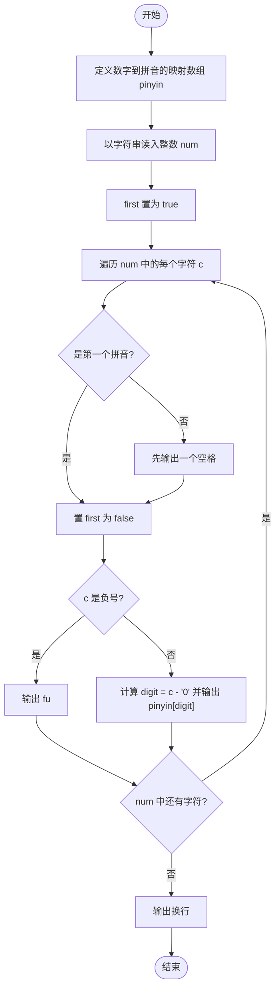
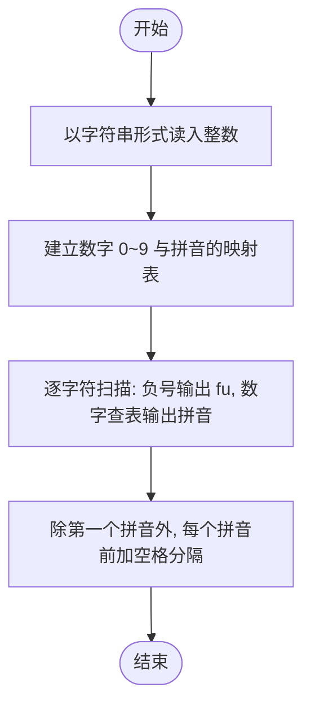

# L1-007 - 念数字（10 分）

- **时间限制**: 400 ms
- **内存限制**: 65536 KB
- **代码长度限制**: 16 KB

---

## 题目描述

输入一个整数，输出每个数字对应的拼音。当整数为负数时，先输出`fu`字。十个数字对应的拼音如下：
```
0: ling
1: yi
2: er
3: san
4: si
5: wu
6: liu
7: qi
8: ba
9: jiu
```

### 输入格式:

输入在一行中给出一个整数，如：`1234`。

<b>提示：整数包括负数、零和正数。</b>

### 输出格式:

在一行中输出这个整数对应的拼音，每个数字的拼音之间用空格分开，行末没有最后的空格。如
`yi er san si`。

### 输入样例:
```in
-600
```

### 输出样例:
```out
fu liu ling ling
```

## 示例

### 示例 1

**输入:**
```
-600
```

**输出:**
```
fu liu ling ling
```

---

## 题目详解

### 一、解题思路

整数可能很大或为负数，直接作为字符串读入逐字符处理即可，无需数值运算。

算法步骤：

1. 建立数字 0~9 到拼音的映射数组 `pinyin[]`。
2. 用字符串 `num` 读入整数（可能带负号 `-`）。
3. 逐字符扫描：字符 `'-'` 对应输出 `fu`；数字字符通过 `c - '0'` 转成索引，输出对应的拼音。
4. 用布尔标志 `first` 控制空格：除第一个拼音外，每个拼音前输出一个空格，保证行末没有多余空格。

### 二、代码流程说明

1. 定义拼音映射表 `string pinyin[] = {"ling", "yi", ...}`。
2. 以字符串 `num` 读入整数。
3. 置 `bool first = true`（标记是否为第一个输出的拼音）。
4. 遍历 `num` 中每个字符 `c`：
   - 若 `!first`，先输出一个空格；
   - 置 `first = false`；
   - 若 `c == '-'`，输出 `fu`；否则计算 `digit = c - '0'`，输出 `pinyin[digit]`。
5. 遍历结束后输出换行，`return 0` 结束程序。

### 三、代码流程图



### 四、解题流程图


