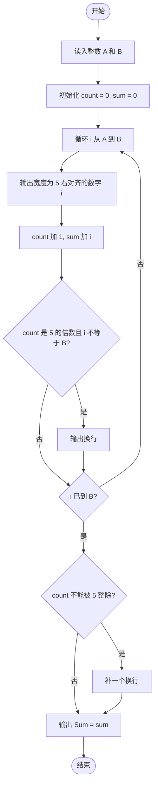
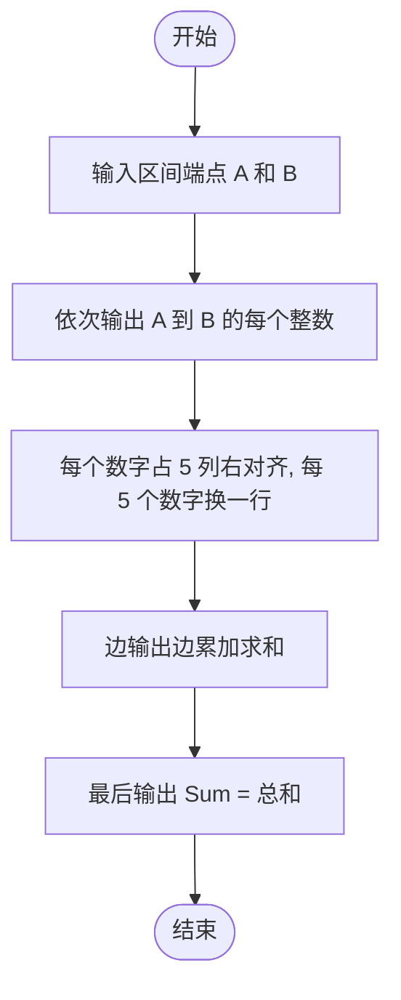

# L1-008 - 求整数段和（10 分）

- **时间限制**: 400 ms
- **内存限制**: 65536 KB
- **代码长度限制**: 16 KB

---

## 题目描述

给定两个整数$$A$$和$$B$$，输出从$$A$$到$$B$$的所有整数以及这些数的和。

### 输入格式:

输入在一行中给出2个整数$$A$$和$$B$$，其中$$-100\le A\le B\le 100$$，其间以空格分隔。

### 输出格式:

首先顺序输出从$$A$$到$$B$$的所有整数，每5个数字占一行，每个数字占5个字符宽度，向右对齐。最后在一行中按`Sum = X`的格式输出全部数字的和`X`。

### 输入样例:
```in
-3 8
```

### 输出样例:
```out
-3   -2   -1    0    1
    2    3    4    5    6
    7    8
Sum = 30
```

## 示例

### 示例 1

**输入:**
```
-3 8
```

**输出:**
```
-3   -2   -1    0    1
    2    3    4    5    6
    7    8
Sum = 30
```

---

## 题目详解

### 一、解题思路

从 A 到 B 遍历所有整数，边输出边累加求和。

算法步骤：

1. 读入区间端点 `A`、`B`。
2. 初始化计数器 `count = 0`（当前行已输出的数字个数）和 `sum = 0`（总和）。
3. 遍历 `i` 从 A 到 B：
   - 用 `setw(5)` 与 `right` 实现每个数字占 5 个字符宽度、右对齐输出；
   - `count++`、`sum += i`；
   - 每满 5 个数字换一行（但最后一个数字后不换行）。
4. 循环结束后，若最后一行不足 5 个数字，补一个换行。
5. 输出 `Sum = sum`。

### 二、代码流程说明

1. 读入 `int A, B`。
2. 初始化 `int count = 0, sum = 0`。
3. 循环 `i` 从 A 到 B：
   - 输出 `cout << setw(5) << right << i;`（宽 5、右对齐）；
   - `count++;`、`sum += i;`；
   - 若 `count % 5 == 0` 且 `i != B`，输出换行。
4. 循环结束后若 `count % 5 != 0`，补一个换行（保证最后一行正常结束）。
5. 输出 `Sum = sum` 并换行，`return 0` 结束程序。

### 三、代码流程图



### 四、解题流程图


