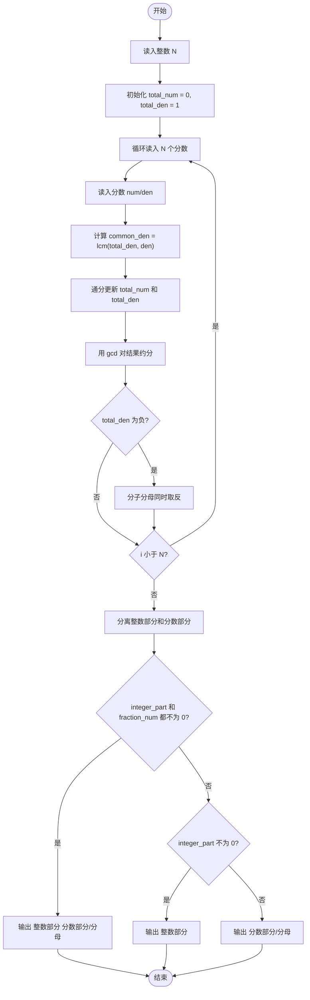
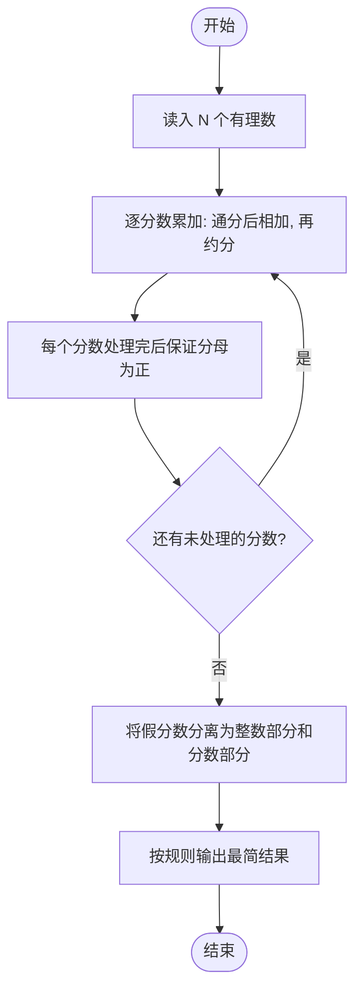

# L1-009 - N个数求和（20 分）

- **时间限制**: 400 ms
- **内存限制**: 65536 KB
- **代码长度限制**: 16 KB

---

## 题目描述

本题的要求很简单，就是求`N`个数字的和。麻烦的是，这些数字是以有理数`分子/分母`的形式给出的，你输出的和也必须是有理数的形式。

### 输入格式:

输入第一行给出一个正整数`N`（$$\le$$100）。随后一行按格式`a1/b1 a2/b2 ...`给出`N`个有理数。题目保证所有分子和分母都在长整型范围内。另外，负数的符号一定出现在分子前面。

### 输出格式:

输出上述数字和的最简形式 —— 即将结果写成`整数部分 分数部分`，其中分数部分写成`分子/分母`，要求分子小于分母，且它们没有公因子。如果结果的整数部分为0，则只输出分数部分。

### 输入样例 1：
```in
5
2/5 4/15 1/30 -2/60 8/3
```

### 输出样例 1：
```out
3 1/3
```

### 输入样例 2：
```in
2
4/3 2/3
```

### 输出样例 2：
```out
2
```

### 输入样例 3：
```in
3
1/3 -1/6 1/8
```

### 输出样例 3：
```out
7/24
```

## 示例

### 示例 1

**输入:**
```
5
2/5 4/15 1/30 -2/60 8/3
```

**输出:**
```
3 1/3
```

### 示例 2

**输入:**
```
2
4/3 2/3
```

**输出:**
```
2
```

### 示例 3

**输入:**
```
3
1/3 -1/6 1/8
```

**输出:**
```
7/24
```

---

## 题目详解

### 一、解题思路

本题要求对 N 个有理数（分子/分母格式）求和，并以最简形式输出。核心思路是**分数加法运算**：

1. 使用两个 `long long` 变量 `total_num` 和 `total_den` 分别表示累计和的分子与分母，初始为 0/1。
2. 逐个读入分数 `num/den`，对每个分数执行：
   - 利用 `lcm(total_den, den)` 求取最小公倍数作为新的公分母 `common_den`；
   - 通分后更新分子：`total_num = total_num * (common_den/total_den) + num * (common_den/den)`；
   - 分母更新为 `total_den = common_den`；
   - 用 `gcd(total_num, total_den)` 对新分数进行约分。
3. 若分母为负，则同时取反分子和分母，保证分母始终为正。
4. 最终将假分数分离为整数部分 `total_num / total_den` 和分数部分 `total_num % total_den`，按题目要求的三种格式之一输出。

### 二、代码流程说明

1. 读入整数 `N`。
2. 初始化 `total_num = 0`、`total_den = 1`。
3. 循环 `i` 从 0 到 N-1：
   - 读入一个分数 `num/den`（`num`、斜杠字符、`den`）；
   - 计算 `common_den = lcm(total_den, den)`；
   - 通分：`total_num = total_num * (common_den/total_den) + num * (common_den/den)`，`total_den = common_den`；
   - 约分：用 `gcd(total_num, total_den)` 同时除分子分母；
   - 若 `total_den < 0`，分子分母同时取反。
4. 计算整数部分 `integer_part = total_num / total_den`，分数部分 `fraction_num = total_num % total_den`。
5. 按规则输出：
   - 若 `integer_part != 0 && fraction_num != 0`：输出 `integer_part fraction_num/total_den`；
   - 若仅 `integer_part != 0`：输出 `integer_part`；
   - 否则：输出 `fraction_num/total_den`。
6. `return 0` 结束程序。

### 三、代码流程图



### 四、解题流程图


