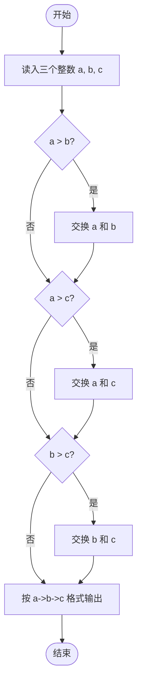
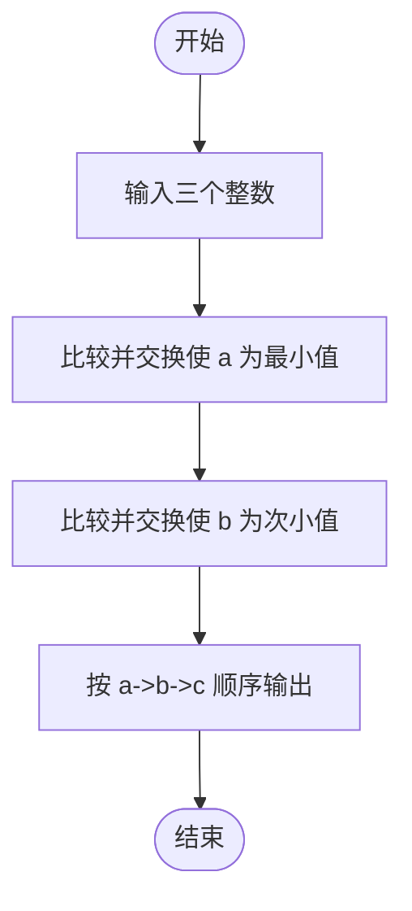

# L1-010 - 比较大小（10 分）

- **时间限制**: 400 ms
- **内存限制**: 65536 KB
- **代码长度限制**: 16 KB

---

## 题目描述

本题要求将输入的任意3个整数从小到大输出。

### 输入格式:

输入在一行中给出3个整数，其间以空格分隔。

### 输出格式:

在一行中将3个整数从小到大输出，其间以“->”相连。

### 输入样例:
```in
4 2 8
```

### 输出样例:
```out
2->4->8
```

## 示例

### 示例 1

**输入:**
```
4 2 8
```

**输出:**
```
2->4->8
```

---

## 题目详解

### 一、解题思路

本题要求将输入的 3 个整数从小到大输出。代码采用**冒泡排序的比较交换思想**，通过三轮比较确保 `a <= b <= c`：

1. 先将 `a` 与 `b` 比较，若 `a > b` 则交换，确保 `a` 是三者中最小的；
2. 再将 `a` 与 `c` 比较，若 `a > c` 则交换，进一步确保 `a` 最小；
3. 最后将 `b` 与 `c` 比较，若 `b > c` 则交换，确保 `b <= c`。
4. 最终按 `a->b->c` 的格式输出。

### 二、代码流程说明

1. 读入三个整数 `int a, b, c`。
2. 使用临时变量 `temp` 进行交换。
3. 若 `a > b`，则交换 `a` 和 `b`。
4. 若 `a > c`，则交换 `a` 和 `c`。
5. 若 `b > c`，则交换 `b` 和 `c`。
6. 输出 `a << "->" << b << "->" << c` 并换行。
7. `return 0` 结束程序。

### 三、代码流程图



### 四、解题流程图


