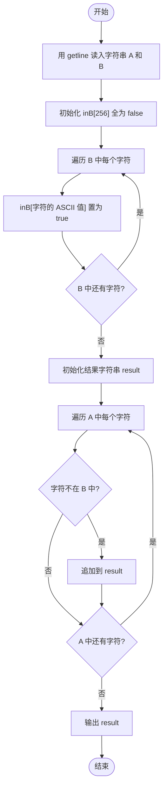
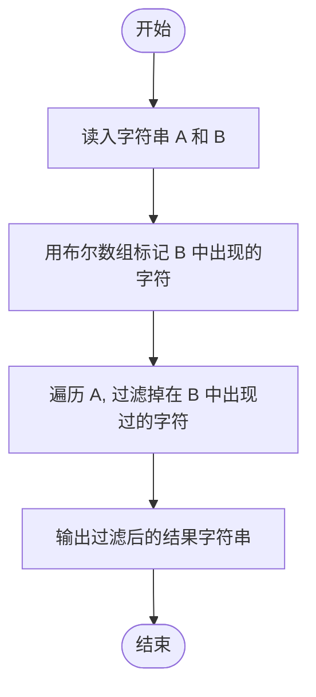

# L1-011 - A-B（20 分）

- **时间限制**: 150 ms
- **内存限制**: 65536 KB
- **代码长度限制**: 16 KB

---

## 题目描述

本题要求你计算$$A-B$$。不过麻烦的是，$$A$$和$$B$$都是字符串 —— 即从字符串$$A$$中把字符串$$B$$所包含的字符全删掉，剩下的字符组成的就是字符串$$A-B$$。

### 输入格式:

输入在2行中先后给出字符串$$A$$和$$B$$。两字符串的长度都不超过$$10^4$$，并且保证每个字符串都是由可见的ASCII码和空白字符组成，最后以换行符结束。

### 输出格式:

在一行中打印出$$A-B$$的结果字符串。

### 输入样例:
```in
I love GPLT!  It's a fun game!
aeiou
```

### 输出样例:
```out
I lv GPLT!  It's  fn gm!
```

## 示例

### 示例 1

**输入:**
```
I love GPLT!  It's a fun game!
aeiou
```

**输出:**
```
I lv GPLT!  It's  fn gm!
```

---

## 题目详解

### 一、解题思路

本题要求从字符串 A 中删除字符串 B 所包含的所有字符。核心思路是**快速查找 + 过滤**：

1. 使用 `bool inB[256]` 数组作为哈希表，标记 B 中出现过的字符（下标为 ASCII 码值）；
2. 遍历字符串 B 的每个字符，将 `inB[(unsigned char)c]` 置为 `true`；
3. 遍历字符串 A 的每个字符，若 `inB[(unsigned char)c]` 为 `false`（即该字符不在 B 中），则追加到结果字符串 `result` 中；
4. 输出最终的 `result`。

### 二、代码流程说明

1. 用 `getline` 读入字符串 `A` 和 `B`（注意包含空格等空白字符）。
2. 初始化 `bool inB[256] = {false}`（标记 B 中出现的字符）。
3. 遍历 `B` 中每个字符 `c`：`inB[(unsigned char)c] = true`。
4. 初始化空字符串 `result`。
5. 遍历 `A` 中每个字符 `c`：若 `!inB[(unsigned char)c]`，则 `result += c`。
6. 输出 `result` 并换行。
7. `return 0` 结束程序。

### 三、代码流程图



### 四、解题流程图


