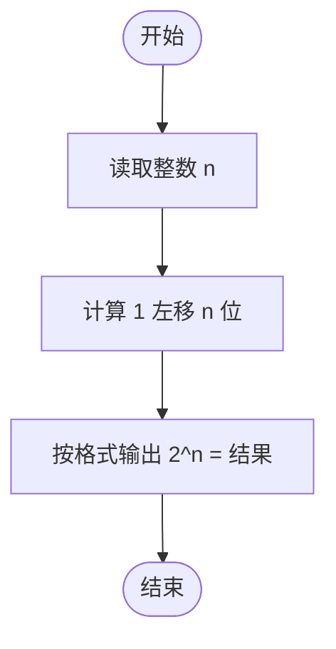
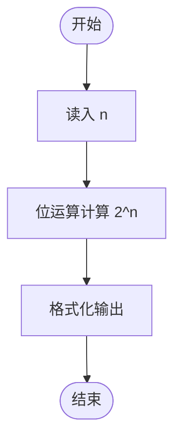

# L1-012 - 计算指数（5 分）

- **时间限制**: 400 ms
- **内存限制**: 65536 KB
- **代码长度限制**: 16 KB

---

## 题目描述

真的没骗你，这道才是简单题 —— 对任意给定的不超过 10 的正整数 $$n$$，要求你输出 $$2^n$$。不难吧？

### 输入格式:

输入在一行中给出一个不超过 10 的正整数 $$n$$。

### 输出格式:

在一行中按照格式  `2^n = 计算结果`  输出 $$2^n$$ 的值。

### 输入样例:
```in
5
```

### 输出样例:
```out
2^5 = 32
```

## 示例

### 示例 1

**输入:**
```
5
```

**输出:**
```
2^5 = 32
```

---

## 题目详解

### 一、解题思路

本题要求计算 2^n。由于 n 不超过 10，可以直接使用**位移运算** 1 << n 高效计算，且结果范围在 int 之内（2^10 = 1024）。

### 二、代码流程说明

1. 读取整数 n。
2. 使用位移运算 1 << n 计算 2^n。
3. 按格式 `2^n = 结果` 输出。
4. 程序结束。

### 三、代码流程图



### 四、解题流程图

