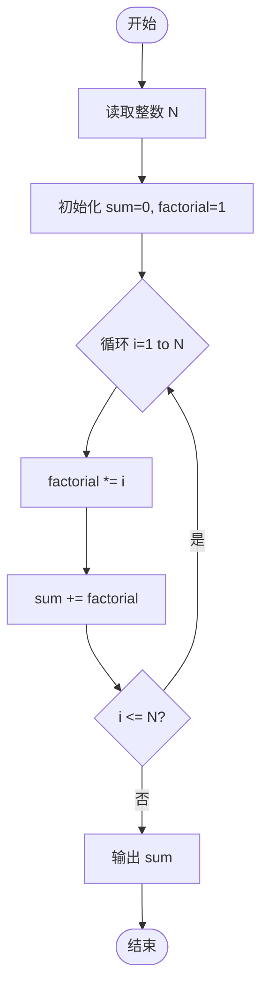
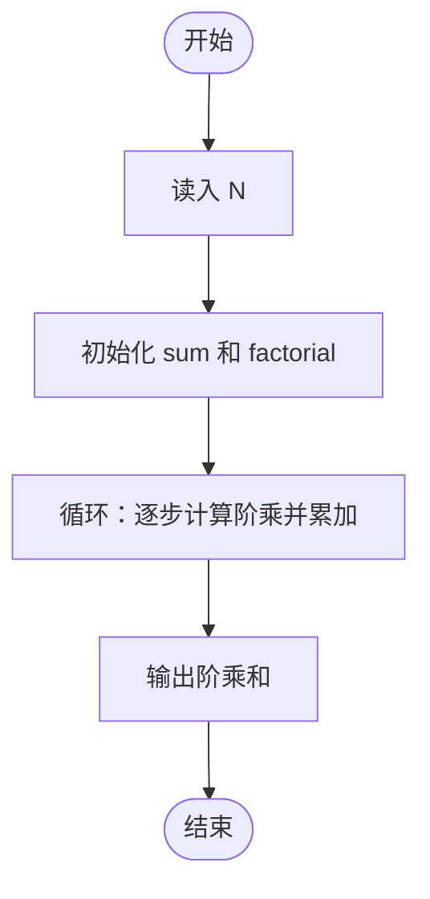

# L1-013 - 计算阶乘和（10 分）

- **时间限制**: 400 ms
- **内存限制**: 65536 KB
- **代码长度限制**: 16 KB

---

## 题目描述

对于给定的正整数$$N$$，需要你计算 $$S = 1! + 2! + 3! + ... + N!$$。

### 输入格式:

输入在一行中给出一个不超过10的正整数$$N$$。

### 输出格式:

在一行中输出$$S$$的值。

### 输入样例:
```in
3
```

### 输出样例:
```out
9
```

## 示例

### 示例 1

**输入:**
```
3
```

**输出:**
```
9
```

---

## 题目详解

### 一、解题思路

本题要求计算 S = 1! + 2! + ... + N!。由于 N 不超过 10，10! = 3628800，可用 int 存储。核心思路是** incremental 计算阶乘**：每次循环用上一次的阶乘值乘以当前 i，避免重复计算。

### 二、代码流程说明

1. 读取整数 N。
2. 初始化 sum = 0（阶乘和），factorial = 1（当前阶乘值）。
3. 从 1 到 N 循环：factorial *= i，然后 sum += factorial。
4. 输出 sum。
5. 程序结束。

### 三、代码流程图



### 四、解题流程图

