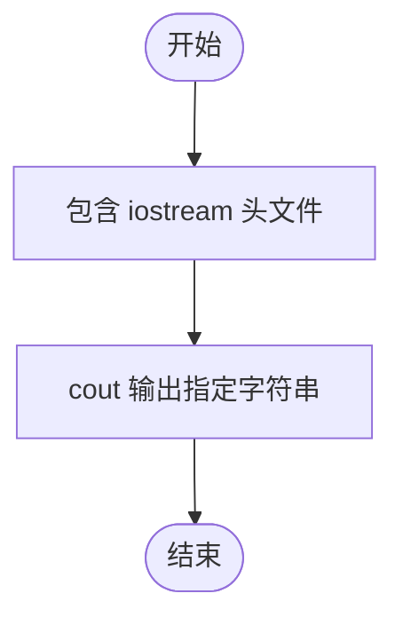
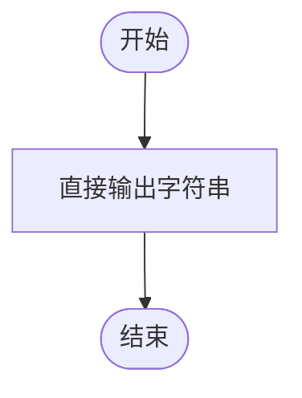

# L1-014 - 简单题（5 分）

- **时间限制**: 400 ms
- **内存限制**: 65536 KB
- **代码长度限制**: 16 KB

---

## 题目描述

这次真的没骗你 —— 这道超级简单的题目没有任何输入。

你只需要在一行中输出事实：`This is a simple problem.` 就可以了。

### 输入样例:
```in
无
```

### 输出样例:
```out
This is a simple problem.
```

## 示例

### 示例 1

**输入:**
```
无
```

**输出:**
```
This is a simple problem.
```

---

## 题目详解

### 一、解题思路

本题是最简单的入门题，不需要任何输入处理，直接使用 cout 输出指定字符串 `This is a simple problem.` 即可。

### 二、代码流程说明

1. 包含头文件 `<iostream>`。
2. 在 main 函数中用 `cout` 输出指定字符串。
3. 程序结束。

### 三、代码流程图



### 四、解题流程图

