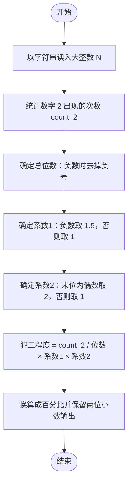

# L1-017 - 到底有多二（15 分）

- **时间限制**: 400 ms
- **内存限制**: 65536 KB
- **代码长度限制**: 16 KB

---

## 题目描述

一个整数“**犯二的程度**”定义为该数字中包含2的个数与其位数的比值。如果这个数是负数，则程度增加0.5倍；如果还是个偶数，则再增加1倍。例如数字`-13142223336`是个11位数，其中有3个2，并且是负数，也是偶数，则它的犯二程度计算为：$$3/11\times 1.5\times 2\times 100\%$$，约为81.82%。本题就请你计算一个给定整数到底有多二。

### 输入格式:

输入第一行给出一个不超过50位的整数`N`。

### 输出格式:

在一行中输出`N`犯二的程度，保留小数点后两位。

### 输入样例:
```in
-13142223336
```

### 输出样例:
```out
81.82%
```

## 示例

### 示例 1

**输入:**
```
-13142223336
```

**输出:**
```
81.82%
```

---

## 题目详解

### 一、解题思路

犯二程度的计算公式为：

```
犯二程度 = 2 的个数 ÷ 总位数 × 系数1 × 系数2 × 100%
```

其中：

- **系数1**：若为负数，取 1.5，否则取 1。
- **系数2**：若为偶数，取 2，否则取 1。

由于 `N` 最长可达 50 位，远超普通整型范围，必须用字符串 `string` 存储。处理要点：

- 负数时负号 `-` 不占位数，总位数要减 1。
- 偶数只看最后一位数字能否被 2 整除。
- 统计字符串中字符 `'2'` 出现的次数。
- 结果保留两位小数并以百分号输出。

### 二、代码流程说明

1. 读取字符串 `N`。
2. 初始化 `count_2 = 0`、`length = N.length()`、`is_negative = false`。
3. 若 `N[0] == '-'`，置 `is_negative = true`，并将 `length` 减 1（负号不算位数）。
4. 用范围 for 循环遍历 `N` 的每个字符 `c`，若 `c == '2'` 则 `count_2` 加 1。
5. 取最后一位字符 `last_digit = N.back()`，判断偶数：`is_even = (last_digit - '0') % 2 == 0`。
6. 计算基础比值 `rate = (double)count_2 / length`。
7. 依次应用系数：若 `is_negative` 则 `rate *= 1.5`；若 `is_even` 则 `rate *= 2`。
8. 用 `fixed << setprecision(2)` 保留两位小数，输出 `rate * 100` 并追加 `%`。

### 三、代码流程图

```mermaid
flowchart TD
    A([开始]) --> B[读取字符串 N]
    B --> C[初始化 count_2 = 0、length = N 的长度、is_negative = false]
    C --> D{N[0] == '-' ？}
    D -- 是 --> E[is_negative = true，length 减 1 排除负号]
    E --> F[遍历 N 的每个字符 c]
    D -- 否 --> F
    F --> G{c == '2' ？}
    G -- 是 --> H[count_2 加 1]
    G -- 否 --> I{所有字符是否遍历完？}
    H --> I
    I -- 否 --> F
    I -- 是 --> J[取最后一位数字判断是否为偶数 is_even]
    J --> K[rate = count_2 除以 length 的浮点比值]
    K --> L{is_negative ？}
    L -- 是 --> M[rate × 1.5]
    L -- 否 --> N{is_even ？}
    M --> N
    N -- 是 --> O[rate × 2]
    N -- 否 --> P[格式化输出 rate × 100，保留两位小数并加百分号]
    O --> P
    P --> Q([结束])
```

### 四、解题流程图


