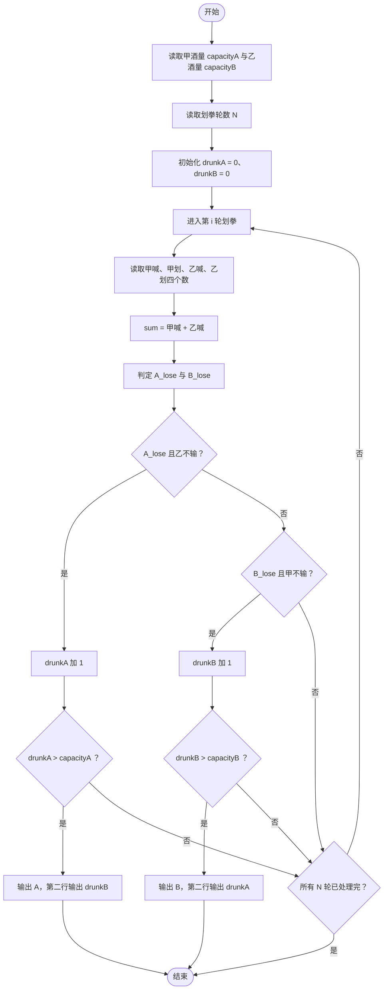
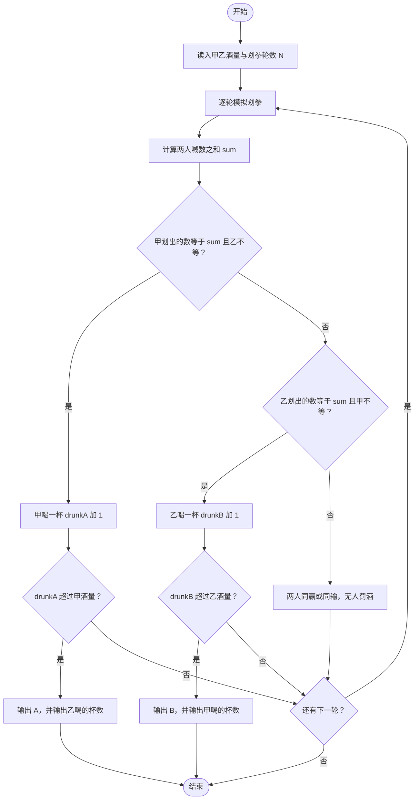

# L1-019 - 谁先倒（15 分）

- **时间限制**: 400 ms
- **内存限制**: 65536 KB
- **代码长度限制**: 16 KB

---

## 题目描述

划拳是古老中国酒文化的一个有趣的组成部分。酒桌上两人划拳的方法为：每人口中喊出一个数字，同时用手比划出一个数字。如果谁比划出的数字正好等于两人喊出的数字之和，谁就输了，输家罚一杯酒。两人同赢或两人同输则继续下一轮，直到唯一的赢家出现。

下面给出甲、乙两人的酒量（最多能喝多少杯不倒）和划拳记录，请你判断两个人谁先倒。

### 输入格式:

输入第一行先后给出甲、乙两人的酒量（不超过100的非负整数），以空格分隔。下一行给出一个正整数`N`（$$\le 100$$），随后`N`行，每行给出一轮划拳的记录，格式为：

```
甲喊 甲划 乙喊 乙划
```

其中`喊`是喊出的数字，`划`是划出的数字，均为不超过100的正整数（两只手一起划）。

### 输出格式:

在第一行中输出先倒下的那个人：`A`代表甲，`B`代表乙。第二行中输出没倒的那个人喝了多少杯。题目保证有一个人倒下。注意程序处理到有人倒下就终止，后面的数据不必处理。

### 输入样例:
```in
1 1
6
8 10 9 12
5 10 5 10
3 8 5 12
12 18 1 13
4 16 12 15
15 1 1 16
```

### 输出样例:
```out
A
1
```

## 示例

### 示例 1

**输入:**
```
1 1
6
8 10 9 12
5 10 5 10
3 8 5 12
12 18 1 13
4 16 12 15
15 1 1 16
```

**输出:**
```
A
1
```

---

## 题目详解

### 一、解题思路

模拟划拳过程：每轮读入甲喊 `shoutA`、甲划 `drawA`、乙喊 `shoutB`、乙划 `drawB`，令 `sum = shoutA + shoutB`。

- 谁划出的数字等于喊数之和谁就输：`A_lose = (drawA == sum)`，`B_lose = (drawB == sum)`。
- **只有一人输时才罚酒**：甲输则 `drunkA` 加 1，乙输则 `drunkB` 加 1；两人同赢或同输都不罚。
- 每轮罚酒结束后检查：若 `drunkA > capacityA`，甲先倒，输出 `A` 和乙已喝的杯数 `drunkB`，立即终止；若 `drunkB > capacityB`，乙先倒，输出 `B` 和甲已喝的杯数 `drunkA`，立即终止。

注意"酒量"是"最多能喝多少杯不倒"，因此喝到 `酒量 + 1` 杯才算倒下，判断条件用严格大于。

### 二、代码流程说明

1. 读取甲、乙酒量 `capacityA`、`capacityB`。
2. 读取划拳轮数 `N`。
3. 初始化 `drunkA = 0`、`drunkB = 0`。
4. 进入第 `i` 轮循环：读取 `shoutA, drawA, shoutB, drawB` 四个数。
5. 计算 `sum = shoutA + shoutB`。
6. 判定 `A_lose = (drawA == sum)`、`B_lose = (drawB == sum)`。
7. 若 `A_lose && !B_lose`：`drunkA` 加 1；否则若 `B_lose && !A_lose`：`drunkB` 加 1。
8. 若 `drunkA > capacityA`：输出 `A` 和 `drunkB`，`return 0` 终止程序。
9. 若 `drunkB > capacityB`：输出 `B` 和 `drunkA`，`return 0` 终止程序。

### 三、代码流程图



### 四、解题流程图


