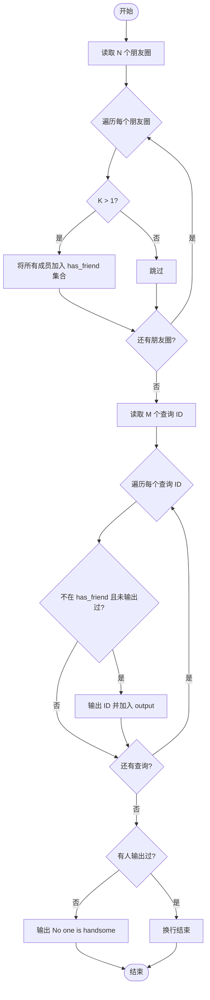
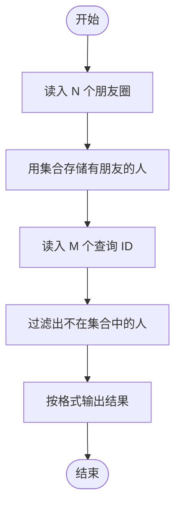

# L1-020 - 帅到没朋友（20 分）

- **时间限制**: 200 ms
- **内存限制**: 65536 KB
- **代码长度限制**: 16 KB

---

## 题目描述

当芸芸众生忙着在朋友圈中发照片的时候，总有一些人因为太帅而没有朋友。本题就要求你找出那些帅到没有朋友的人。

### 输入格式:

输入第一行给出一个正整数`N`（$$\le 100$$），是已知朋友圈的个数；随后`N`行，每行首先给出一个正整数`K`（$$\le 1000$$），为朋友圈中的人数，然后列出一个朋友圈内的所有人——为方便起见，每人对应一个ID号，为5位数字（从00000到99999），ID间以空格分隔；之后给出一个正整数`M`（$$\le 10000$$），为待查询的人数；随后一行中列出`M`个待查询的ID，以空格分隔。

注意：没有朋友的人可以是根本没安装“朋友圈”，也可以是只有自己一个人在朋友圈的人。虽然有个别自恋狂会自己把自己反复加进朋友圈，但题目保证所有`K`超过1的朋友圈里都至少有2个不同的人。

### 输出格式:

按输入的顺序输出那些帅到没朋友的人。ID间用1个空格分隔，行的首尾不得有多余空格。如果没有人太帅，则输出`No one is handsome`。

注意：同一个人可以被查询多次，但只输出一次。

### 输入样例 1：
```in
3
3 11111 22222 55555
2 33333 44444
4 55555 66666 99999 77777
8
55555 44444 10000 88888 22222 11111 23333 88888
```

### 输出样例 1：
```out
10000 88888 23333
```

### 输入样例 2：
```in
3
3 11111 22222 55555
2 33333 44444
4 55555 66666 99999 77777
4
55555 44444 22222 11111
```

### 输出样例 2：
```out
No one is handsome
```

## 示例

### 示例 1

**输入:**
```
3
3 11111 22222 55555
2 33333 44444
4 55555 66666 99999 77777
8
55555 44444 10000 88888 22222 11111 23333 88888
```

**输出:**
```
10000 88888 23333
```

### 示例 2

**输入:**
```
3
3 11111 22222 55555
2 33333 44444
4 55555 66666 99999 77777
4
55555 44444 22222 11111
```

**输出:**
```
No one is handsome
```

---

## 题目详解

### 一、解题思路

本题要求找出"帅到没朋友"的人。核心思路是**用集合存储有朋友的人**：

1. 如果一个人出现在人数 K > 1 的朋友圈中，则他有朋友。
2. 如果一个人只在 K = 1 的朋友圈中，或从未出现过，则他没有朋友。
3. 查询时，不在集合中的人即为"帅到没朋友"的人。
4. 使用另一个集合去重，确保同一人只输出一次。

### 二、代码流程说明

1. 读取朋友圈数量 N。
2. 遍历 N 个朋友圈：若 K > 1，将所有成员加入 `has_friend` 集合；若 K = 1，跳过（此人无朋友）。
3. 读取待查询数量 M。
4. 遍历 M 个查询 ID：若 ID 不在 `has_friend` 且不在 `output` 集合中，则输出并加入 `output`。
5. 若没有任何人符合条件，输出 `No one is handsome`。
6. 程序结束。

### 三、代码流程图



### 四、解题流程图

