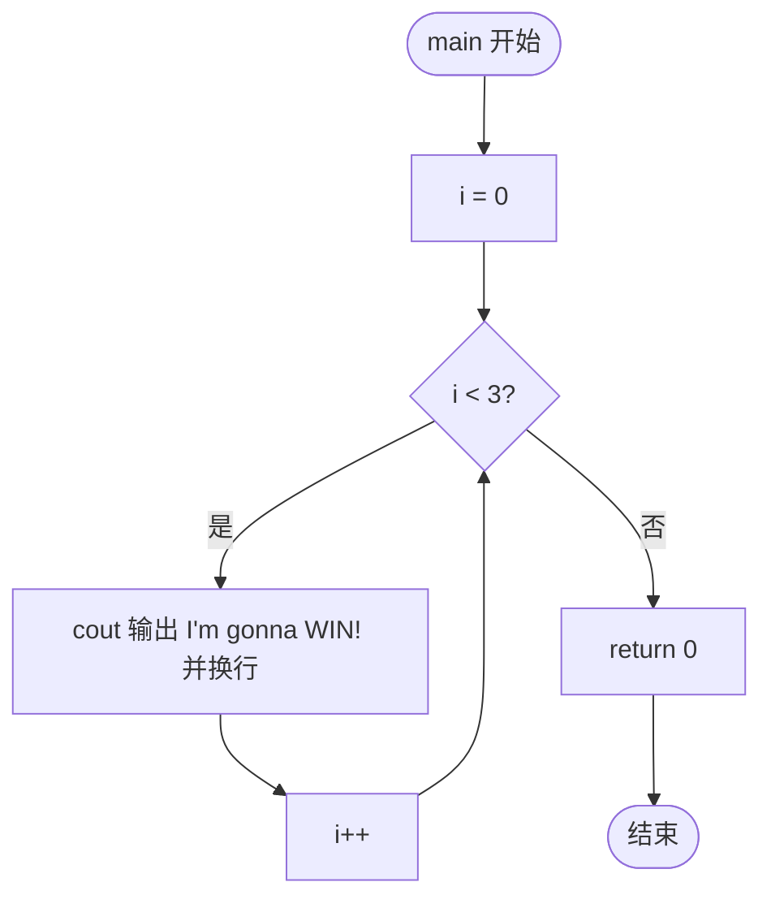
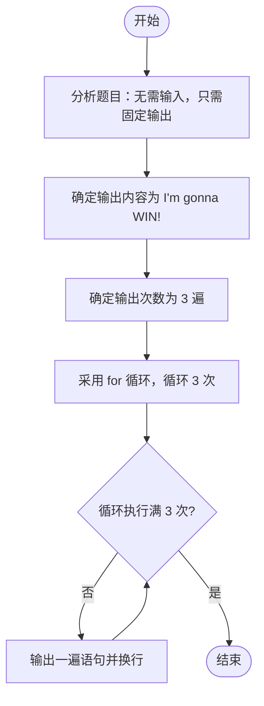

# L1-021 - 重要的话说三遍（5 分）

- **时间限制**: 400 ms
- **内存限制**: 65536 KB
- **代码长度限制**: 16 KB

---

## 题目描述

这道超级简单的题目没有任何输入。

你只需要把这句很重要的话 —— “I'm gonna WIN!”——连续输出三遍就可以了。

注意每遍占一行，除了每行的回车不能有任何多余字符。

### 输入样例:
```in
无
```

### 输出样例:
```out
I'm gonna WIN!
I'm gonna WIN!
I'm gonna WIN!
```

## 示例

### 示例 1

**输入:**
```
无
```

**输出:**
```
I'm gonna WIN!
I'm gonna WIN!
I'm gonna WIN!
```

---

## 题目详解

### 一、解题思路

本题没有任何输入，只需要将固定字符串 `"I'm gonna WIN!"` 连续输出三遍，每遍占一行。代码采用 `for` 循环实现：循环变量 `i` 从 0 开始，循环条件为 `i < 3`，每轮循环调用 `cout << "I'm gonna WIN!" << endl` 输出一遍语句并换行，直到循环执行满 3 次后退出，最后 `return 0` 结束程序。由于输出内容、次数均为固定常量，无需处理输入，也无需额外数据结构，核心就是一次简单的循环输出。

### 二、代码流程说明

1. 程序从 `main` 函数开始执行。
2. 初始化循环变量 `i = 0`。
3. 判断循环条件 `i < 3` 是否成立。
4. 若成立，执行循环体：`cout << "I'm gonna WIN!" << endl` 输出一遍语句并换行。
5. 循环体执行完毕后 `i++`，回到步骤 3 继续判断。
6. 当 `i` 增大到 3 时，`i < 3` 不成立，退出循环。
7. 执行 `return 0`，程序正常结束。

### 三、代码流程图



### 四、解题流程图


