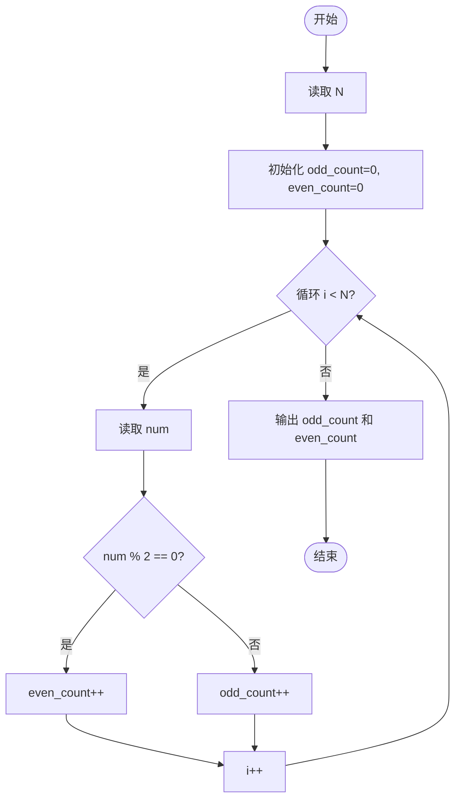
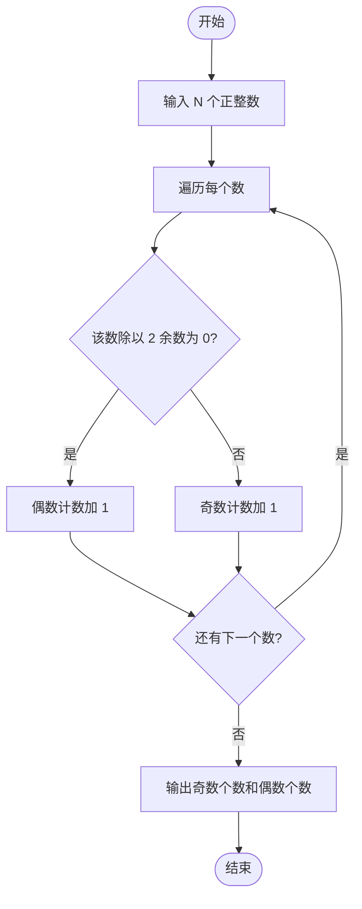

# L1-022 - 奇偶分家（10 分）

- **时间限制**: 400 ms
- **内存限制**: 65536 KB
- **代码长度限制**: 16 KB

---

## 题目描述

给定`N`个正整数，请统计奇数和偶数各有多少个？

### 输入格式:

输入第一行给出一个正整`N`（$$\le 1000$$）；第2行给出`N`个非负整数，以空格分隔。

### 输出格式:

在一行中先后输出奇数的个数、偶数的个数。中间以1个空格分隔。

### 输入样例:
```in
9
88 74 101 26 15 0 34 22 77
```

### 输出样例:
```out
3 6
```

## 示例

### 示例 1

**输入:**
```
9
88 74 101 26 15 0 34 22 77
```

**输出:**
```
3 6
```

---

## 题目详解

### 一、解题思路
本题要求统计 N 个正整数中奇数和偶数的个数。核心思路是利用取模运算判断奇偶性：一个整数除以 2 余数为 0 即为偶数，否则为奇数。程序使用两个计数器 `odd_count` 和 `even_count` 分别记录奇数和偶数的数量，遍历每个输入数字进行判断累加即可。

### 二、代码流程说明
1. 读取整数 N，表示后续将输入 N 个正整数
2. 初始化两个计数器 `odd_count = 0` 和 `even_count = 0`
3. 使用 for 循环依次读取每个整数 `num`
4. 判断 `num % 2 == 0` 是否成立：若成立则 `even_count++`，否则 `odd_count++`
5. 循环结束后输出 `odd_count` 和 `even_count`

### 三、代码流程图


### 四、解题流程图

