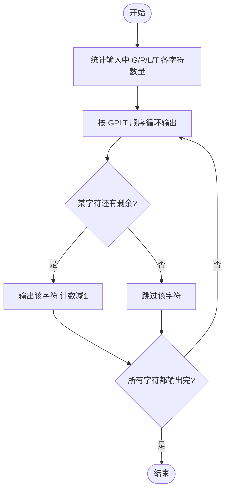

# L1-023 - 输出GPLT（20 分）

- **时间限制**: 150 ms
- **内存限制**: 65536 KB
- **代码长度限制**: 16 KB

---

## 题目描述

给定一个长度不超过10000的、仅由英文字母构成的字符串。请将字符重新调整顺序，按`GPLTGPLT....`这样的顺序输出，并忽略其它字符。当然，四种字符（不区分大小写）的个数不一定是一样多的，若某种字符已经输出完，则余下的字符仍按`GPLT`的顺序打印，直到所有字符都被输出。

### 输入格式:

输入在一行中给出一个长度不超过10000的、仅由英文字母构成的非空字符串。

### 输出格式:

在一行中按题目要求输出排序后的字符串。题目保证输出非空。

### 输入样例:
```in
pcTclnGloRgLrtLhgljkLhGFauPewSKgt
```

### 输出样例:
```out
GPLTGPLTGLTGLGLL
```

## 示例

### 示例 1

**输入:**
```
pcTclnGloRgLrtLhgljkLhGFauPewSKgt
```

**输出:**
```
GPLTGPLTGLTGLGLL
```

---

## 题目详解

### 一、解题思路
本题要求将输入字符串中的 G、P、L、T 四种字符按 GPLT 顺序重新排列输出。分两步处理：第一步统计输入字符串中四个字符的个数（不区分大小写，使用 `toupper` 统一转为大写判断）；第二步按 G→P→L→T 的顺序循环输出，每次输出一个字符后对应计数减 1，直到所有计数都为 0。

### 二、代码流程说明
1. 使用 `getline` 读取整行字符串 `s`
2. 初始化 `count[4]` 数组，分别记录 G、P、L、T 的个数
3. 遍历字符串每个字符，通过 `toupper(c)` 转换为大写后用 switch 语句统计各字符数量
4. 进入 while 循环，只要任一计数大于 0 就继续：依次检查 count[0]~count[3]，若对应字符计数 > 0 则输出该字符并减 1
5. 循环结束后换行输出

### 三、代码流程图
```mermaid
flowchart TD
    A([开始]) --> B[读取字符串 s]
    B --> C[初始化 count数组为0]
    C --> D[遍历 s 中每个字符]
    D --> E[toupper转换为大写]
    E --> F{匹配 G/P/L/T?}
    F -- 是 --> G[对应 count[i]++]
    F -- 否 --> H[跳过]
    G --> I{还有字符?}
    H --> I
    I -- 是 --> D
    I -- 否 --> J{任一 count > 0?}
    J -- 是 --> K[依次检查 G,P,L/T]
    K --> L{count[i] > 0?}
    L -- 是 --> M[输出字符并 count[i]--]
    L -- 否 --> N[跳过]
    M --> J
    N --> J
    J -- 否 --> O[换行输出]
    O --> P([结束])
```

### 四、解题流程图

