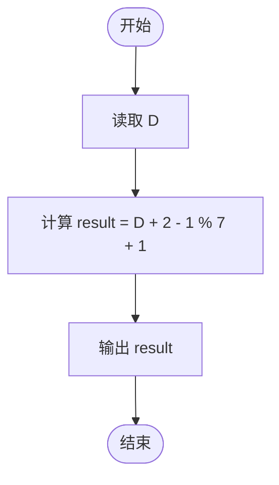
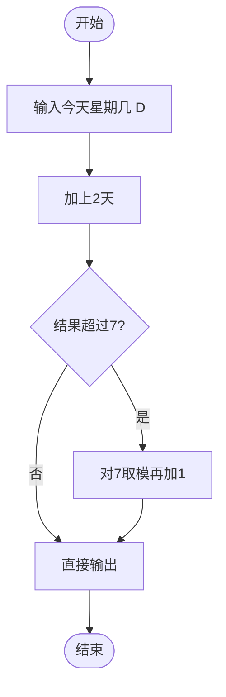

# L1-024 - 后天（5 分）

- **时间限制**: 400 ms
- **内存限制**: 65536 KB
- **代码长度限制**: 16 KB

---

## 题目描述

如果今天是星期三，后天就是星期五；如果今天是星期六，后天就是星期一。我们用数字1到7对应星期一到星期日。给定某一天，请你输出那天的“后天”是星期几。

### 输入格式:

输入第一行给出一个正整数`D`（1 $$\le$$ `D` $$\le$$ 7），代表星期里的某一天。

### 输出格式:

在一行中输出`D`天的后天是星期几。

### 输入样例:
```in
3
```

### 输出样例:
```out
5
```

## 示例

### 示例 1

**输入:**
```
3
```

**输出:**
```
5
```

---

## 题目详解

### 一、解题思路
本题是一个简单的星期推算问题。给定今天是星期几（1-7），要求输出后天是星期几。关键在于处理星期的循环特性：星期以 7 为周期循环。使用公式 `(D + 2 - 1) % 7 + 1` 可以正确处理边界情况，将结果始终映射到 1-7 的范围内。例如当 D=6 时，结果为 1（星期一）；当 D=7 时，结果为 2（星期二）。

### 二、代码流程说明
1. 读取整数 D，表示今天是星期几（1-7）
2. 使用公式 `(D + 2 - 1) % 7 + 1` 计算后天的星期数
3. 输出计算结果

### 三、代码流程图


### 四、解题流程图

