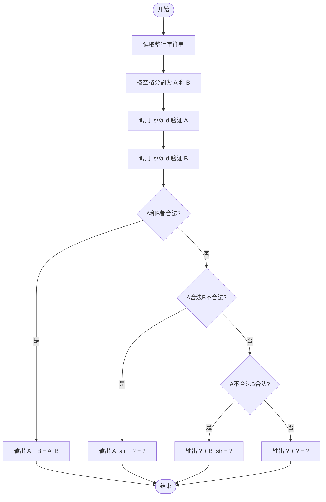
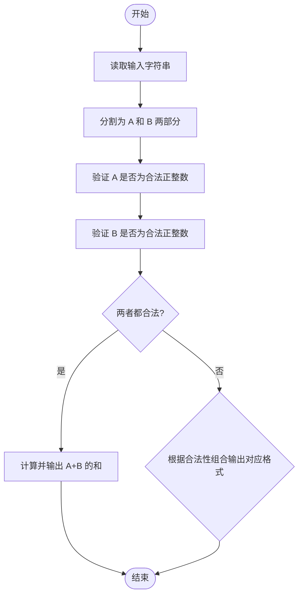

# L1-025 - 正整数A+B（15 分）

- **时间限制**: 400 ms
- **内存限制**: 65536 KB
- **代码长度限制**: 16 KB

---

## 题目描述

题的目标很简单，就是求两个正整数`A`和`B`的和，其中`A`和`B`都在区间[1,1000]。稍微有点麻烦的是，输入并不保证是两个正整数。

### 输入格式:

输入在一行给出`A`和`B`，其间以空格分开。问题是`A`和`B`不一定是满足要求的正整数，有时候可能是超出范围的数字、负数、带小数点的实数、甚至是一堆乱码。

注意：我们把输入中出现的第1个空格认为是`A`和`B`的分隔。题目保证至少存在一个空格，并且`B`不是一个空字符串。

### 输出格式:

如果输入的确是两个正整数，则按格式`A + B = 和`输出。如果某个输入不合要求，则在相应位置输出`?`，显然此时和也是`?`。

### 输入样例 1：
```in
123 456
```

### 输出样例 1：
```out
123 + 456 = 579
```

### 输入样例 2：
```in
22. 18
```

### 输出样例 2：
```out
? + 18 = ?
```

### 输入样例 3：
```in
-100 blabla bla...33
```

### 输出样例 3：
```out
? + ? = ?
```

## 示例

### 示例 1

**输入:**
```
123 456
```

**输出:**
```
123 + 456 = 579
```

### 示例 2

**输入:**
```
22. 18
```

**输出:**
```
? + 18 = ?
```

### 示例 3

**输入:**
```
-100 blabla bla...33
```

**输出:**
```
? + ? = ?
```

---

## 题目详解

### 一、解题思路
本题要求对输入的两个字符串进行合法性验证，判断它们是否为区间 [1,1000] 内的正整数。验证规则有三条：字符串不为空、全由数字组成、数值在 1 到 1000 范围内。根据 A 和 B 的 valid 组合情况，输出四种格式之一：都合法则输出 A+B=和；A 合法 B 不合法输出 A+?=?；A 不合法 B 合法输出 ?+B=?；都不合法输出 ?+?=?。

### 二、代码流程说明
1. 使用 `getline` 读取整行输入
2. 用 `find(' ')` 找到第一个空格位置，将字符串分为 A_str 和 B_str 两部分
3. 调用 `isValid` 函数分别验证 A 和 B：检查非空、全为数字、数值在 [1,1000] 范围
4. 根据 A_valid 和 B_valid 的组合输出对应格式的结果
5. 若两个都合法则转换为整数相加输出和

### 三、代码流程图


### 四、解题流程图

