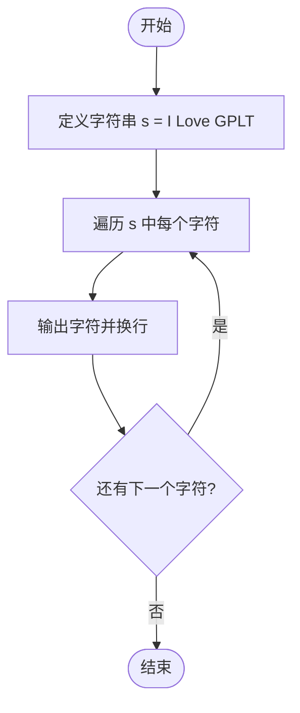
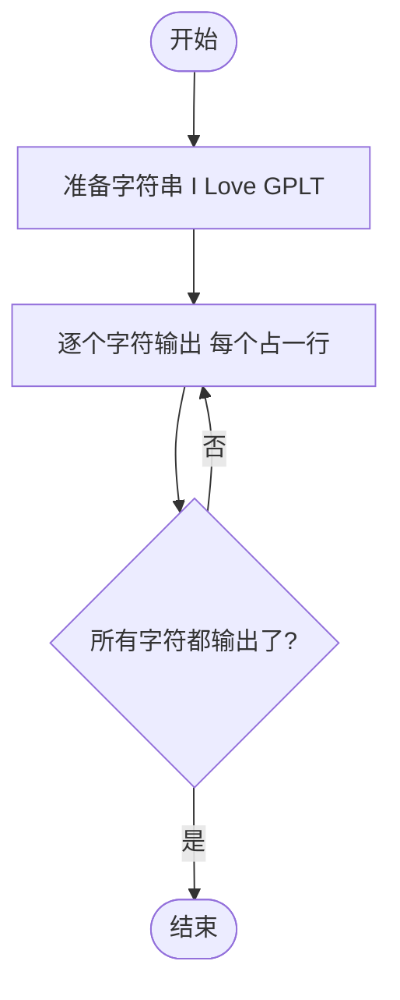

# L1-026 - I Love GPLT（5 分）

- **时间限制**: 400 ms
- **内存限制**: 65536 KB
- **代码长度限制**: 16 KB

---

## 题目描述

这道超级简单的题目没有任何输入。

你只需要把这句很重要的话 —— “I Love GPLT”——竖着输出就可以了。

所谓“竖着输出”，是指每个字符占一行（包括空格），即每行只能有1个字符和回车。

### 输入样例:
```in
无
```

### 输出样例:
```out
I
 
L
o
v
e
 
G
P
L
T
```

## 示例

### 示例 1

**输入:**
```
无
```

**输出:**
```
I
 
L
o
v
e
 
G
P
L
T
```

---

## 题目详解

### 一、解题思路
本题没有输入，要求将字符串 "I Love GPLT" 中的每个字符（包括空格）竖向输出，即每个字符独占一行。核心思路非常简单：遍历字符串中的每个字符，逐个输出并换行即可。注意字符串中包含两个空格字符，也需要各占一行输出。

### 二、代码流程说明
1. 定义字符串常量 `s = "I Love GPLT"`
2. 使用范围 for 循环遍历 `s` 中的每个字符 `c`
3. 对每个字符执行 `cout << c << endl`，即输出字符后换行
4. 循环结束，程序结束

### 三、代码流程图


### 四、解题流程图

