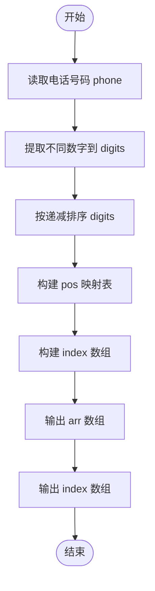
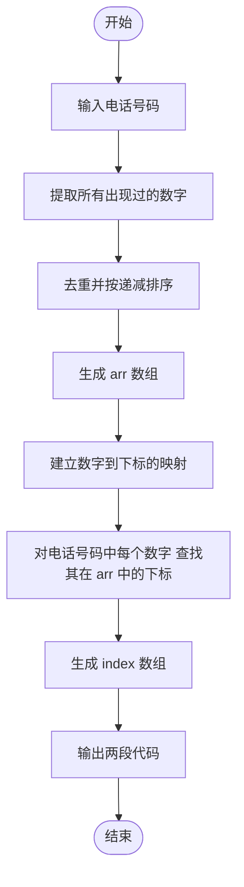

# L1-027 - 出租（20 分）

- **时间限制**: 400 ms
- **内存限制**: 65536 KB
- **代码长度限制**: 16 KB

---

## 题目描述

下面是新浪微博上曾经很火的一张图：


一时间网上一片求救声，急问这个怎么破。其实这段代码很简单，`index`数组就是`arr`数组的下标，`index[0]=2` 对应 `arr[2]=1`，`index[1]=0` 对应 `arr[0]=8`，`index[2]=3` 对应 `arr[3]=0`，以此类推…… 很容易得到电话号码是`18013820100`。

本题要求你编写一个程序，为任何一个电话号码生成这段代码 —— 事实上，只要生成最前面两行就可以了，后面内容是不变的。

### 输入格式:

输入在一行中给出一个由11位数字组成的手机号码。

### 输出格式:

为输入的号码生成代码的前两行，其中`arr`中的数字必须按递减顺序给出。

### 输入样例:
```in
18013820100
```

### 输出样例:
```out
int[] arr = new int[]{8,3,2,1,0};
int[] index = new int[]{3,0,4,3,1,0,2,4,3,4,4};
```

## 示例

### 示例 1

**输入:**
```
18013820100
```

**输出:**
```
int[] arr = new int[]{8,3,2,1,0};
int[] index = new int[]{3,0,4,3,1,0,2,4,3,4,4};
```

---

## 题目详解

### 一、解题思路
本题要求根据电话号码生成两段代码：`arr` 数组包含电话号码中所有出现过的数字，按递减顺序排列且去重；`index` 数组记录电话号码中每个数字在 `arr` 数组中的下标。解题分为三步：第一步遍历电话号码提取所有不同数字；第二步将这些数字按递减排序得到 `arr`；第三步建立数字到下标的映射，对电话号码中每个数字查找其在 `arr` 中的位置组成 `index`。

### 二、代码流程说明
1. 读取 11 位电话号码字符串 `phone`
2. 遍历 `phone` 中每个字符，用 `seen[10]` 数组去重，将首次出现的数字加入 `digits` 向量
3. 使用 `sort` 配合反向迭代器将 `digits` 按递减顺序排序
4. 构建 `pos[10]` 映射表，记录每个数字在 `digits` 中的下标位置
5. 再次遍历 `phone`，对每个数字通过 `pos` 查表得到下标，组成 `index` 向量
6. 按固定格式输出 `arr` 数组和 `index` 数组

### 三、代码流程图


### 四、解题流程图

