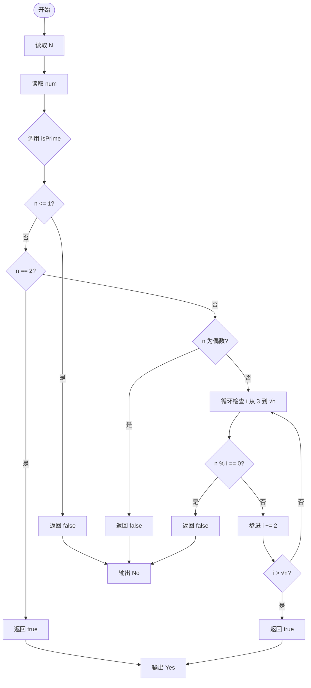
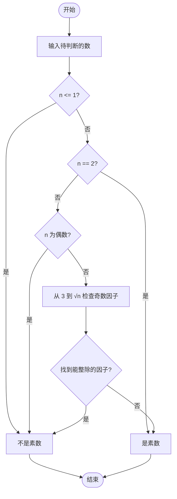

# L1-028 - 判断素数（10 分）

- **时间限制**: 400 ms
- **内存限制**: 65536 KB
- **代码长度限制**: 16 KB

---

## 题目描述

本题的目标很简单，就是判断一个给定的正整数是否素数。

### 输入格式:

输入在第一行给出一个正整数`N`（$$\le$$ 10），随后`N`行，每行给出一个小于$$2^{31}$$的需要判断的正整数。

### 输出格式:

对每个需要判断的正整数，如果它是素数，则在一行中输出`Yes`，否则输出`No`。

### 输入样例:
```in
2
11
111
```

### 输出样例:
```out
Yes
No
```

## 示例

### 示例 1

**输入:**
```
2
11
111
```

**输出:**
```
Yes
No
```

---

## 题目详解

### 一、解题思路
本题要求判断给定的正整数是否为素数。素数定义为大于 1 且除了 1 和自身外没有其他因数的自然数。判断方法采用常见的优化策略：排除 ≤1 的数、单独处理 2、排除偶数后，仅检查从 3 到 √n 的所有奇数是否能整除 n，时间复杂度为 O(√n)。

### 二、代码流程说明
1. 读取整数 N，表示需要判断的数字个数
2. 对每个待判断数字 `num` 调用 `isPrime` 函数
3. `isPrime` 函数依次检查：n ≤ 1 返回 false；n == 2 返回 true；n 为偶数返回 false
4. 从 i = 3 开始，每次步进 2（只检查奇数），直到 i > √n
5. 若发现 n 能被 i 整除则返回 false，否则返回 true
6. 根据返回值输出 Yes 或 No

### 三、代码流程图


### 四、解题流程图

