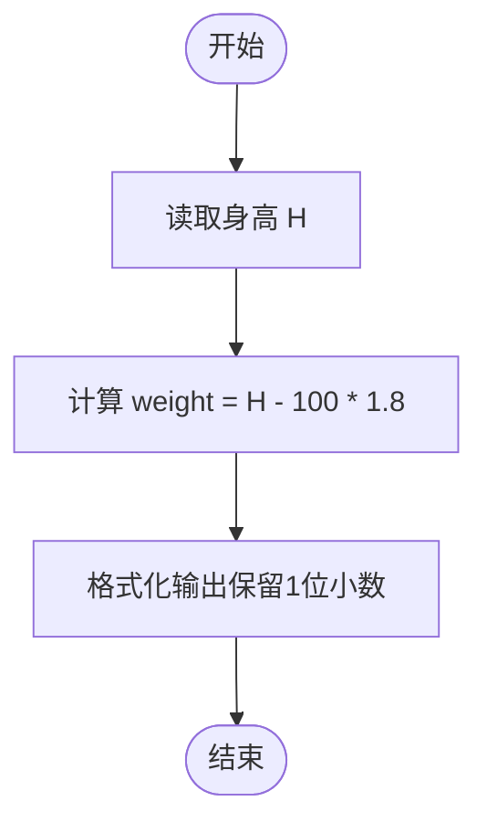
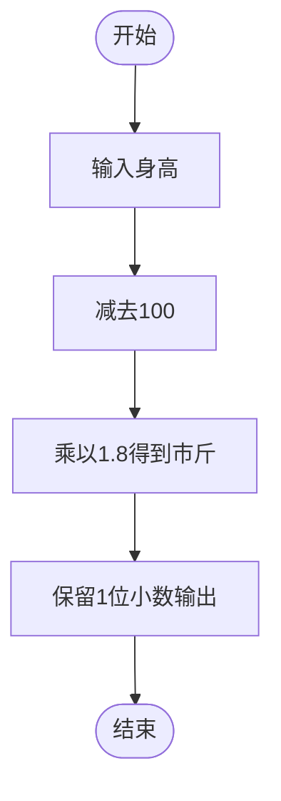

# L1-029 - 是不是太胖了（5 分）

- **时间限制**: 400 ms
- **内存限制**: 65536 KB
- **代码长度限制**: 16 KB

---

## 题目描述

据说一个人的标准体重应该是其身高（单位：厘米）减去100、再乘以0.9所得到的公斤数。已知市斤的数值是公斤数值的两倍。现给定某人身高，请你计算其标准体重应该是多少？（顺便也悄悄给自己算一下吧……）

### 输入格式:

输入第一行给出一个正整数`H`（100 $$<$$ `H` $$\le$$ 300），为某人身高。

### 输出格式:

在一行中输出对应的标准体重，单位为市斤，保留小数点后1位。

### 输入样例:
```in
169
```

### 输出样例:
```out
124.2
```

## 示例

### 示例 1

**输入:**
```
169
```

**输出:**
```
124.2
```

---

## 题目详解

### 一、解题思路
本题要求根据身高计算标准体重（市斤）。公式推导：标准体重（公斤）= (身高 - 100) × 0.9，转换为市斤需乘以 2，因此最终公式为 标准体重（市斤）= (身高 - 100) × 1.8。程序读取身高 H 后直接套用公式计算，并使用 `fixed` 和 `setprecision(1)` 控制输出保留 1 位小数。

### 二、代码流程说明
1. 读取整数 H（身高，单位：厘米）
2. 按照公式 `weight = (H - 100) * 1.8` 计算标准体重（市斤）
3. 使用 `fixed << setprecision(1)` 格式化输出，保留 1 位小数

### 三、代码流程图


### 四、解题流程图

