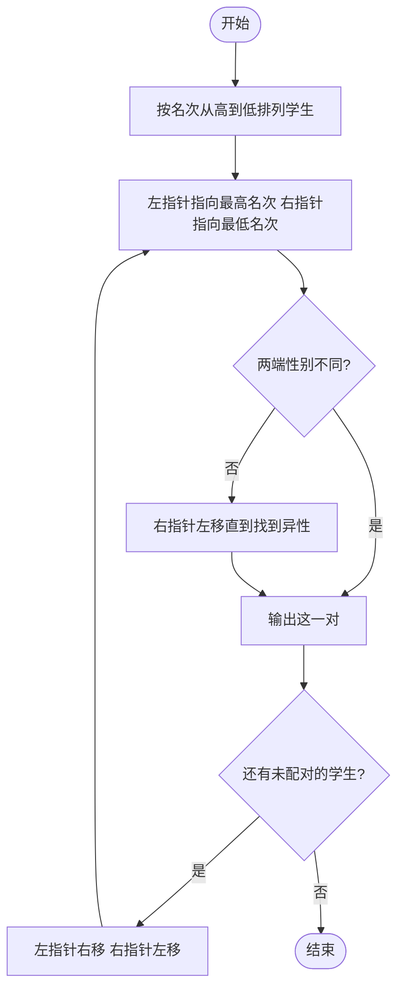

# L1-030 - 一帮一（15 分）

- **时间限制**: 400 ms
- **内存限制**: 65536 KB
- **代码长度限制**: 16 KB

---

## 题目描述

“一帮一学习小组”是中小学中常见的学习组织方式，老师把学习成绩靠前的学生跟学习成绩靠后的学生排在一组。本题就请你编写程序帮助老师自动完成这个分配工作，即在得到全班学生的排名后，在当前尚未分组的学生中，将名次最靠前的学生与名次最靠后的**异性**学生分为一组。

### 输入格式:

输入第一行给出正偶数`N`（$$\le$$50），即全班学生的人数。此后`N`行，按照名次从高到低的顺序给出每个学生的性别（0代表女生，1代表男生）和姓名（不超过8个英文字母的非空字符串），其间以1个空格分隔。这里保证本班男女比例是1:1，并且没有并列名次。

### 输出格式:

每行输出一组两个学生的姓名，其间以1个空格分隔。名次高的学生在前，名次低的学生在后。小组的输出顺序按照前面学生的名次从高到低排列。

### 输入样例:
```in
8
0 Amy
1 Tom
1 Bill
0 Cindy
0 Maya
1 John
1 Jack
0 Linda
```

### 输出样例:
```out
Amy Jack
Tom Linda
Bill Maya
Cindy John
```

## 示例

### 示例 1

**输入:**
```
8
0 Amy
1 Tom
1 Bill
0 Cindy
0 Maya
1 John
1 Jack
0 Linda
```

**输出:**
```
Amy Jack
Tom Linda
Bill Maya
Cindy John
```

---

## 题目详解

### 一、解题思路
本题要求将排名最靠前的学生与排名最靠后的异性学生分为一组。采用双指针法：左指针 `i` 从数组头部开始（名次最高），右指针 `j` 从数组末尾开始（名次最低）。对于每个左指针指向的学生，右指针向左移动找到第一个性别不同的学生进行配对。配对后两个指针同时向中间移动，直到相遇为止。

### 二、代码流程说明
1. 读取学生人数 N
2. 读取每个学生的性别 `gender[i]` 和姓名 `name[i]`
3. 初始化左指针 `i = 0`，右指针 `j = N - 1`
4. 当 `i < j` 时循环：从 `j` 向左查找第一个与 `gender[i]` 不同的学生
5. 输出 `name[i]` 和 `name[j]` 作为一组
6. `i++`，`j--`，继续下一轮配对
7. 循环结束，所有学生配对完成

### 三、代码流程图
```mermaid
flowchart TD
    A([开始]) --> B[读取 N 和学生信息]
    B --> C[初始化 i=0, j=N-1]
    C --> D{i < j?}
    D -- 是 --> E{gender[j] == gender[i]?}
    E -- 是 --> F[j--]
    F --> E
    E -- 否 --> G[输出 name[i] name[j]]
    G --> H[i++, j--]
    H --> D
    D -- 否 --> I([结束])
```

### 四、解题流程图

