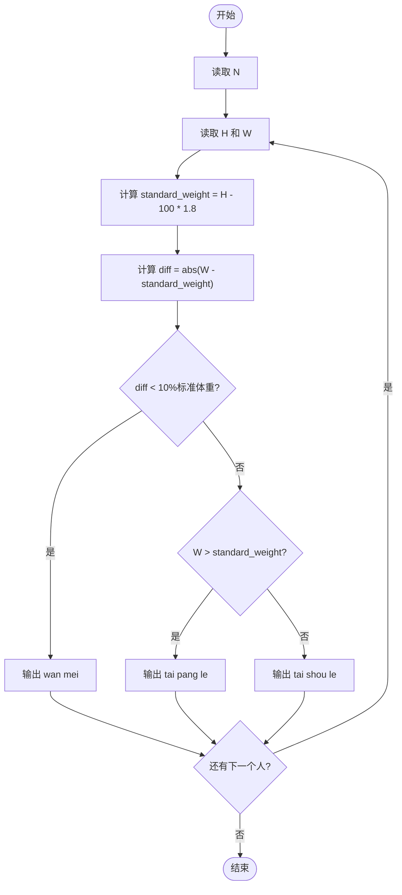
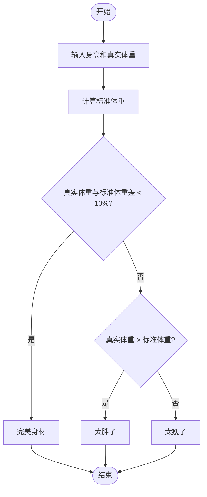

# L1-031 - 到底是不是太胖了（10 分）

- **时间限制**: 400 ms
- **内存限制**: 65536 KB
- **代码长度限制**: 16 KB

---

## 题目描述

据说一个人的标准体重应该是其身高（单位：厘米）减去100、再乘以0.9所得到的公斤数。真实体重与标准体重误差在10%以内都是完美身材（即 | 真实体重 $$-$$ 标准体重 | $$<$$ 标准体重$$\times 10\%$$）。已知 1 公斤等于 2 市斤。现给定一群人的身高和实际体重，请你告诉他们是否太胖或太瘦了。

### 输入格式:

输入第一行给出一个正整数`N`（$$\le$$ 20）。随后`N`行，每行给出两个整数，分别是一个人的身高`H`（120 $$<$$ `H` $$<$$ 200；单位：厘米）和真实体重`W`（50 $$<$$ `W` $$\le$$ 300；单位：市斤），其间以空格分隔。

### 输出格式:

为每个人输出一行结论：如果是完美身材，输出`You are wan mei!`；如果太胖了，输出`You are tai pang le!`；否则输出`You are tai shou le!`。

### 输入样例:
```in
3
169 136
150 81
178 155
```

### 输出样例:
```out
You are wan mei!
You are tai shou le!
You are tai pang le!
```

## 示例

### 示例 1

**输入:**
```
3
169 136
150 81
178 155
```

**输出:**
```
You are wan mei!
You are tai shou le!
You are tai pang le!
```

---

## 题目详解

### 一、解题思路
本题要求判断每个人的体重是否在完美身材范围内。标准体重（市斤）公式为 (H-100)×1.8。完美身材条件是真实体重与标准体重的误差小于标准体重的 10%。程序对每个人计算标准体重后，求出真实体重与标准体重差值的绝对值，判断是否在 10% 误差内。若完美则输出 wan mei，否则根据真实体重与标准体重的大小关系判断太胖或太瘦。

### 二、代码流程说明
1. 读取人数 N
2. 对每个人读取身高 H 和真实体重 W（市斤）
3. 计算标准体重 `standard_weight = (H - 100) * 1.8`
4. 计算差值绝对值 `diff = abs(W - standard_weight)`
5. 判断 `diff < standard_weight * 0.1`：是则输出 wan mei
6. 否则判断 `W > standard_weight`：是则输出 tai pang le，否则输出 tai shou le

### 三、代码流程图


### 四、解题流程图

