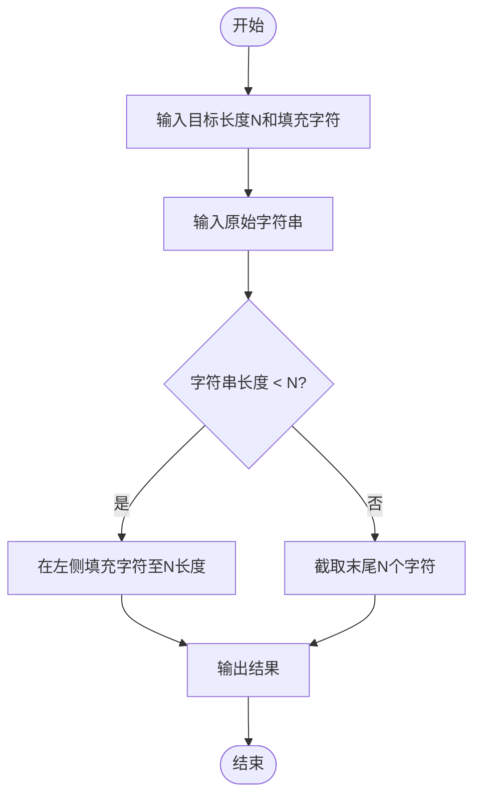

# L1-032 - Left-pad（20 分）

- **时间限制**: 400 ms
- **内存限制**: 65536 KB
- **代码长度限制**: 16 KB

---

## 题目描述

根据新浪微博上的消息，有一位开发者不满NPM（Node Package Manager）的做法，收回了自己的开源代码，其中包括一个叫left-pad的模块，就是这个模块把javascript里面的React/Babel干瘫痪了。这是个什么样的模块？就是在字符串前填充一些东西到一定的长度。例如用`*`去填充字符串`GPLT`，使之长度为10，调用left-pad的结果就应该是`******GPLT`。Node社区曾经对left-pad紧急发布了一个替代，被严重吐槽。下面就请你来实现一下这个模块。

### 输入格式:

输入在第一行给出一个正整数`N`（$$\le 10^4$$）和一个字符，分别是填充结果字符串的长度和用于填充的字符，中间以1个空格分开。第二行给出原始的非空字符串，以回车结束。

### 输出格式:

在一行中输出结果字符串。

### 输入样例 1：
```in
15 _
I love GPLT
```

### 输出样例 1：
```out
____I love GPLT
```

### 输入样例 2：
```in
4 *
this is a sample for cut
```

### 输出样例 2：
```out
cut
```

## 示例

### 示例 1

**输入:**
```
15 _
I love GPLT
```

**输出:**
```
____I love GPLT
```

### 示例 2

**输入:**
```
4 *
this is a sample for cut
```

**输出:**
```
cut
```

---

## 题目详解

### 一、解题思路
本题要求实现 left-pad 功能：在字符串左侧填充指定字符使其达到目标长度，或当字符串已超过目标长度时截取末尾 N 个字符。程序分两种情况处理：若原始字符串长度小于 N，则在左侧填充 (N - len) 个指定字符；若长度已达到或超过 N，则使用 `substr` 截取末尾 N 个字符。

### 二、代码流程说明
1. 读取目标长度 N 和填充字符 `pad_char`
2. 使用 `cin.ignore()` 忽略换行符，然后用 `getline` 读取原始字符串 `s`
3. 判断 `s.length() < N`：若是则计算 `pad_count = N - s.length()`，构造填充字符串并拼接
4. 否则使用 `s.substr(s.length() - N)` 截取末尾 N 个字符
5. 输出结果字符串

### 三、代码流程图
```mermaid
flowchart TD
    A([开始]) --> B[读取 N 和填充字符]
    B --> C[读取原始字符串 s]
    C --> D{s.length < N?}
    D -- 是 --> E[计算 pad_count = N - s.length]
    E --> F[构造 填充字符*pad_count + s]
    D -- 否 --> G[截取 s.substr(s.length - N)]
    F --> H[输出结果]
    G --> H
    H --> I([结束])
```

### 四、解题流程图

