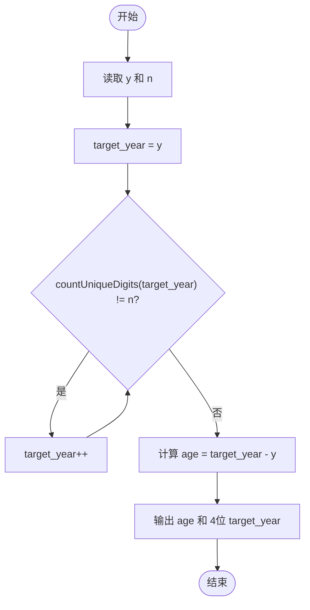
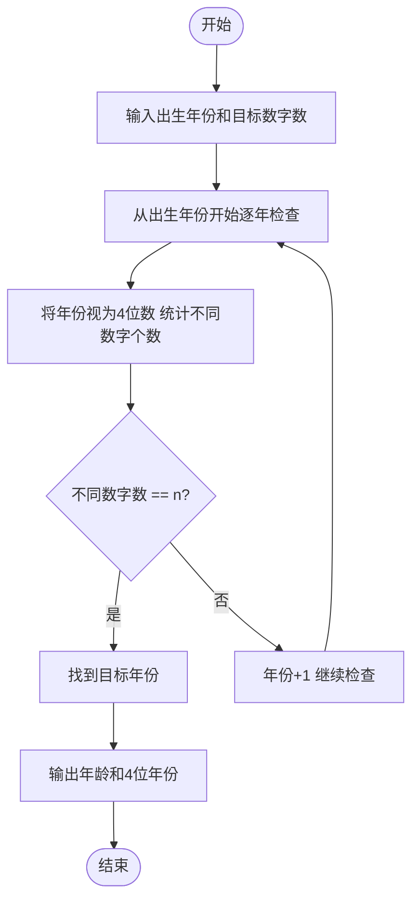

# L1-033 - 出生年（15 分）

- **时间限制**: 400 ms
- **内存限制**: 65536 KB
- **代码长度限制**: 16 KB

---

## 题目描述


以上是新浪微博中一奇葩贴：“我出生于1988年，直到25岁才遇到4个数字都不相同的年份。”也就是说，直到2013年才达到“4个数字都不相同”的要求。本题请你根据要求，自动填充“我出生于`y`年，直到`x`岁才遇到`n`个数字都不相同的年份”这句话。

### 输入格式:

输入在一行中给出出生年份`y`和目标年份中不同数字的个数`n`，其中`y`在[1, 3000]之间，`n`可以是2、或3、或4。注意不足4位的年份要在前面补零，例如公元1年被认为是0001年，有2个不同的数字0和1。

### 输出格式:

根据输入，输出`x`和能达到要求的年份。数字间以1个空格分隔，行首尾不得有多余空格。年份要按4位输出。注意：所谓“`n`个数字都不相同”是指不同的数字正好是`n`个。如“2013”被视为满足“4位数字都不同”的条件，但不被视为满足2位或3位数字不同的条件。

### 输入样例 1：
```in
1988 4
```

### 输出样例 1：
```out
25 2013
```

### 输入样例 2：
```in
1 2
```

### 输出样例 2：
```out
0 0001
```

## 示例

### 示例 1

**输入:**
```
1988 4
```

**输出:**
```
25 2013
```

### 示例 2

**输入:**
```
1 2
```

**输出:**
```
0 0001
```

---

## 题目详解

### 一、解题思路
本题要求从出生年份开始，逐年查找第一个满足"恰好 n 个不同数字"的年份。程序将年份视为 4 位数（不足补零），用 `countUniqueDigits` 函数统计其中不同数字的个数。从出生年份 y 开始递增，直到找到满足条件的年份。最后输出年龄（目标年份 - 出生年份）和目标年份（4 位格式）。

### 二、代码流程说明
1. 读取出生年份 y 和目标不同数字个数 n
2. `countUniqueDigits` 函数：通过取模 10 和整除 10 逐位提取 4 位数字，用 `seen[10]` 数组统计不同数字数量
3. 从 y 开始循环调用 `countUniqueDigits`，直到找到不同数字数等于 n 的年份
4. 计算年龄 `age = target_year - y`
5. 使用 `setw(4) << setfill('0')` 格式化输出年龄和 4 位年份

### 三、代码流程图


### 四、解题流程图

