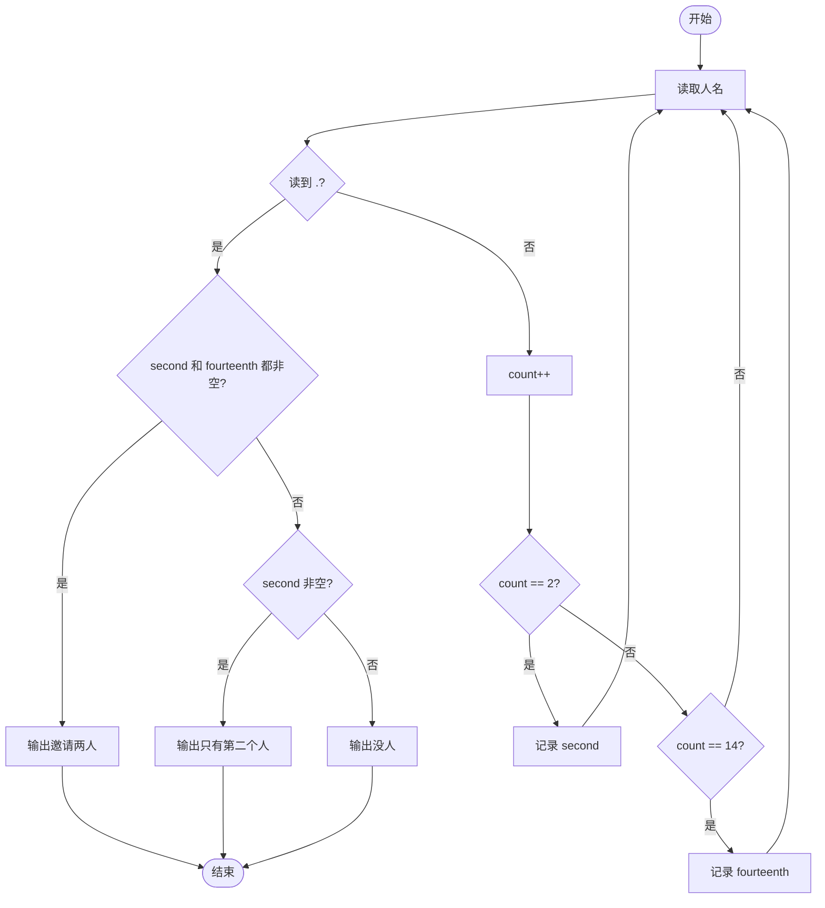
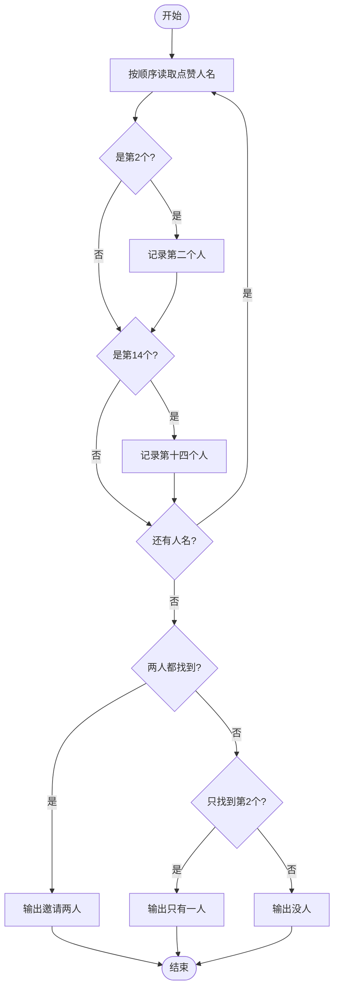

# L1-035 - 情人节（15 分）

- **时间限制**: 400 ms
- **内存限制**: 65536 KB
- **代码长度限制**: 16 KB

---

## 题目描述


以上是朋友圈中一奇葩贴：“2月14情人节了，我决定造福大家。第2个赞和第14个赞的，我介绍你俩认识…………咱三吃饭…你俩请…”。现给出此贴下点赞的朋友名单，请你找出那两位要请客的倒霉蛋。

### 输入格式:

输入按照点赞的先后顺序给出不知道多少个点赞的人名，每个人名占一行，为不超过10个英文字母的非空单词，以回车结束。一个英文句点`.`标志输入的结束，这个符号不算在点赞名单里。

### 输出格式:

根据点赞情况在一行中输出结论：若存在第2个人A和第14个人B，则输出“A and B are inviting you to dinner...”；若只有A没有B，则输出“A is the only one for you...”；若连A都没有，则输出“Momo... No one is for you ...”。

### 输入样例 1：
```in
GaoXZh
Magi
Einst
Quark
LaoLao
FatMouse
ZhaShen
fantacy
latesum
SenSen
QuanQuan
whatever
whenever
Potaty
hahaha
.
```

### 输出样例 1：
```out
Magi and Potaty are inviting you to dinner...
```

### 输入样例 2：
```in
LaoLao
FatMouse
whoever
.
```

### 输出样例 2：
```out
FatMouse is the only one for you...
```

### 输入样例 3：
```in
LaoLao
.
```

### 输出样例 3：
```out
Momo... No one is for you ...
```

## 示例

### 示例 1

**输入:**
```
GaoXZh
Magi
Einst
Quark
LaoLao
FatMouse
ZhaShen
fantacy
latesum
SenSen
QuanQuan
whatever
whenever
Potaty
hahaha
.
```

**输出:**
```
Magi and Potaty are inviting you to dinner...
```

### 示例 2

**输入:**
```
LaoLao
FatMouse
whoever
.
```

**输出:**
```
FatMouse is the only one for you...
```

### 示例 3

**输入:**
```
LaoLao
.
```

**输出:**
```
Momo... No one is for you ...
```

---

## 题目详解

### 一、解题思路
本题要求在点赞名单中找到第 2 个和第 14 个点赞的人。程序按顺序读取人名，遇到句点结束。在读取过程中记录第 2 个（`second`）和第 14 个（`fourteenth`）人名，最后根据两人是否存在输出对应结论。三种情况：两人都存在输出邀请两人；只有第 2 个存在输出只有一人；都不存在输出没有邀请。

### 二、代码流程说明
1. 使用 while 循环持续读取每个人名 `name`
2. 当读到 "." 时跳出循环
3. 计数器 `count` 加 1，当 `count == 2` 时记录 `second`，当 `count == 14` 时记录 `fourteenth`
4. 循环结束后判断：若两者都非空则输出两人邀请语句；若仅 `second` 非空则输出只有一人；否则输出没人

### 三、代码流程图


### 四、解题流程图

