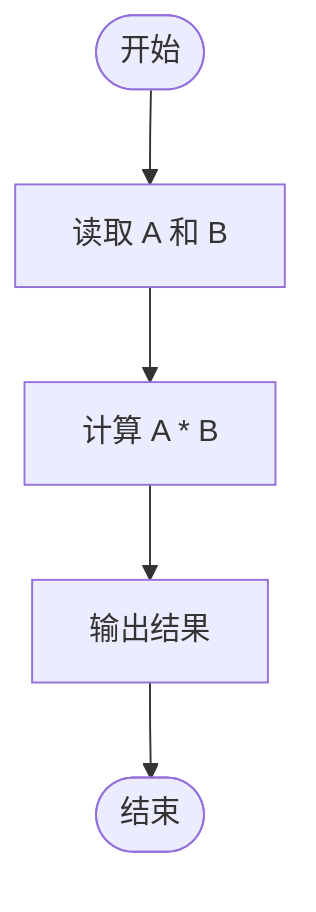
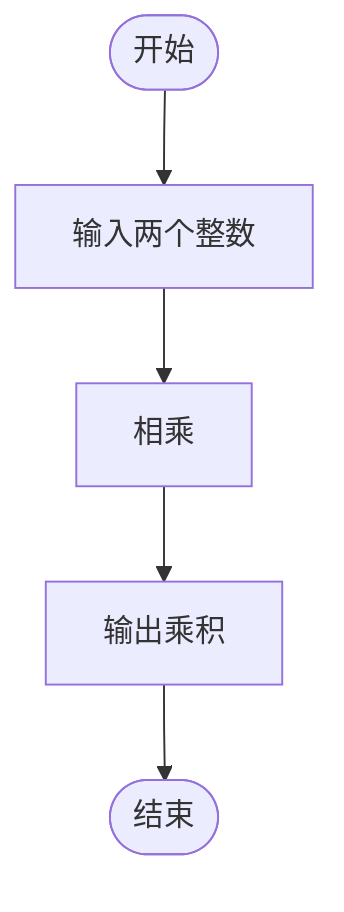

# L1-036 - A乘以B（5 分）

- **时间限制**: 400 ms
- **内存限制**: 65536 KB
- **代码长度限制**: 16 KB

---

## 题目描述

看我没骗你吧 —— 这是一道你可以在 10 秒内完成的题：给定两个绝对值不超过 100 的整数 $$A$$ 和 $$B$$，输出 $$A$$ 乘以 $$B$$ 的值。

### 输入格式:

输入在第一行给出两个整数 $$A$$ 和 $$B$$（$$-100 \le A, B \le 100$$），数字间以空格分隔。

### 输出格式:

在一行中输出 $$A$$ 乘以 $$B$$ 的值。

### 输入样例:
```in
-8 13
```

### 输出样例:
```out
-104
```

## 示例

### 示例 1

**输入:**
```
-8 13
```

**输出:**
```
-104
```

---

## 题目详解

### 一、解题思路
本题是最简单的入门题，要求计算两个整数 A 和 B 的乘积。直接读取两个整数并输出乘积即可，没有额外的逻辑处理或边界情况需要考虑。

### 二、代码流程说明
1. 读取两个整数 A 和 B
2. 计算 A * B
3. 输出乘积结果

### 三、代码流程图


### 四、解题流程图

