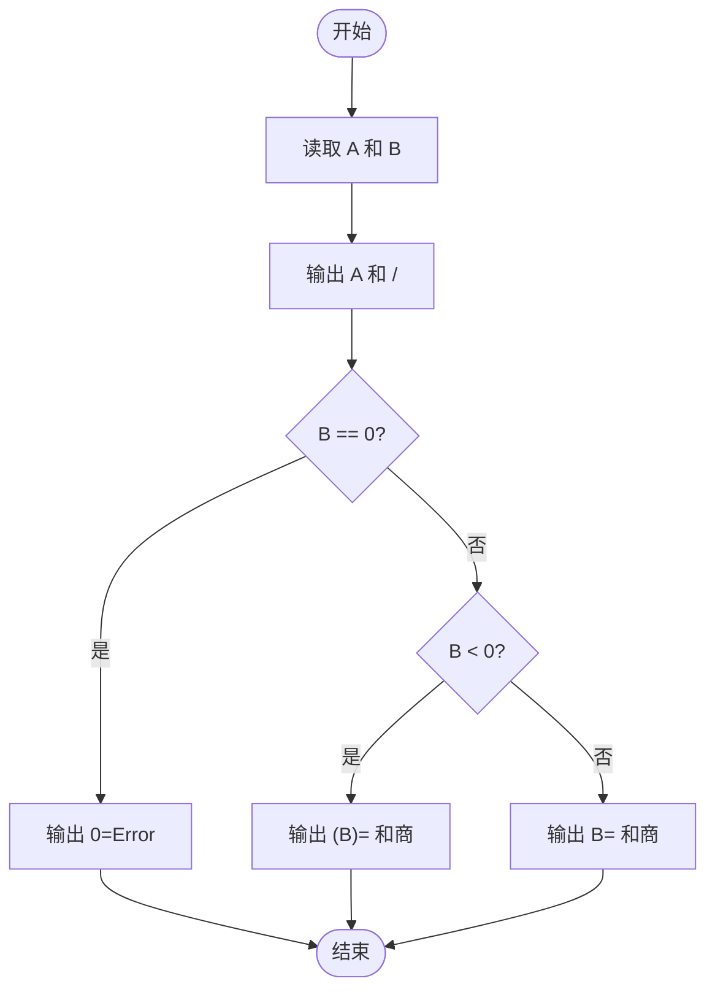
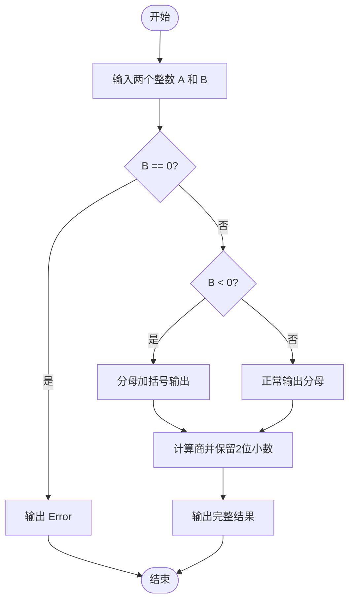

# L1-037 - A除以B（10 分）

- **时间限制**: 400 ms
- **内存限制**: 65536 KB
- **代码长度限制**: 16 KB

---

## 题目描述

真的是简单题哈 —— 给定两个绝对值不超过100的整数$$A$$和$$B$$，要求你按照“$$A/B=$$商”的格式输出结果。

### 输入格式:

输入在第一行给出两个整数$$A$$和$$B$$（$$-100 \le A, B \le 100$$），数字间以空格分隔。

### 输出格式:

在一行中输出结果：如果分母是正数，则输出“$$A/B=$$商”；如果分母是负数，则要用括号把分母括起来输出；如果分母为零，则输出的商应为`Error`。输出的商应保留小数点后2位。

### 输入样例 1：
```in
-1 2
```

### 输出样例 1：
```out
-1/2=-0.50
```

### 输入样例 2：
```in
1 -3
```

### 输出样例 2：
```out
1/(-3)=-0.33
```

### 输入样例 3：
```in
5 0
```

### 输出样例 3：
```out
5/0=Error
```

## 示例

### 示例 1

**输入:**
```
-1 2
```

**输出:**
```
-1/2=-0.50
```

### 示例 2

**输入:**
```
1 -3
```

**输出:**
```
1/(-3)=-0.33
```

### 示例 3

**输入:**
```
5 0
```

**输出:**
```
5/0=Error
```

---

## 题目详解

### 一、解题思路
本题要求按 `A/B=商` 的格式输出除法运算结果，需要处理三种特殊情况：分母 B 为 0 时输出 Error；分母 B 为负数时需要用括号括起来；分母 B 为正数时正常输出。商统一保留小数点后 2 位。程序按照 B 的值分三条分支处理输出格式。

### 二、代码流程说明
1. 读取两个整数 A 和 B
2. 先输出 A 和 "/"
3. 判断 B 的值：若 B == 0 则输出 "0=Error"；若 B < 0 则输出 "(B)=" 及商；若 B > 0 则输出 "B=" 及商
4. 商使用 `fixed << setprecision(2)` 格式保留 2 位小数

### 三、代码流程图


### 四、解题流程图

