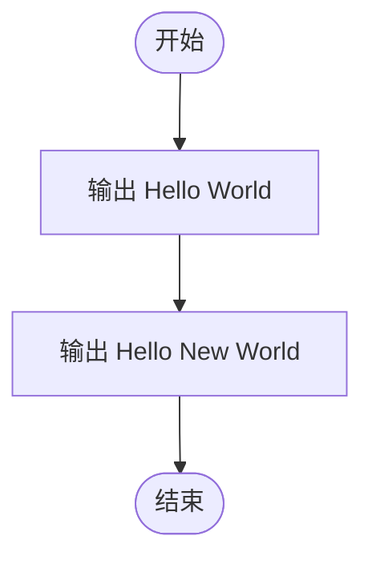
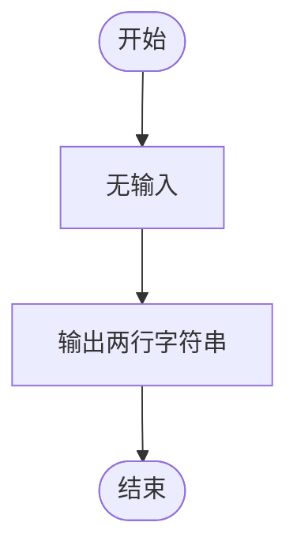

# L1-038 - 新世界（5 分）

- **时间限制**: 400 ms
- **内存限制**: 65536 KB
- **代码长度限制**: 16 KB

---

## 题目描述

这道超级简单的题目没有任何输入。

你只需要在第一行中输出程序员钦定名言“Hello World”，并且在第二行中输出更新版的“Hello New World”就可以了。

### 输入样例:
```in
无
```

### 输出样例:
```out
Hello World
Hello New World
```

## 示例

### 示例 1

**输入:**
```
无
```

**输出:**
```
Hello World
Hello New World
```

---

## 题目详解

### 一、解题思路
本题是最简单的入门题之一，没有任何输入要求，只需要输出两行固定的字符串：第一行 "Hello World"，第二行 "Hello New World"。程序直接使用 `cout` 输出两行即可。

### 二、代码流程说明
1. 第一行输出 "Hello World" 并换行
2. 第二行输出 "Hello New World" 并换行
3. 程序结束

### 三、代码流程图


### 四、解题流程图

