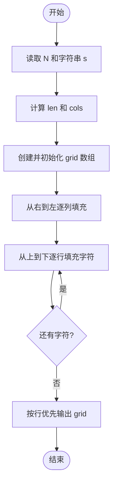
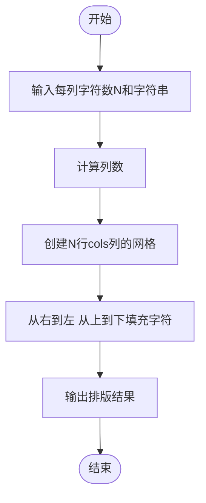

# L1-039 - 古风排版（20 分）

- **时间限制**: 400 ms
- **内存限制**: 65536 KB
- **代码长度限制**: 16 KB

---

## 题目描述

中国的古人写文字，是从右向左竖向排版的。本题就请你编写程序，把一段文字按古风排版。

### 输入格式:

输入在第一行给出一个正整数$$N$$（$$<100$$），是每一列的字符数。第二行给出一个长度不超过1000的非空字符串，以回车结束。

### 输出格式:

按古风格式排版给定的字符串，每列$$N$$个字符（除了最后一列可能不足$$N$$个）。

### 输入样例:
```in
4
This is a test case
```

### 输出样例:
```out
asa T
st ih
e tsi
 ce s
```

## 示例

### 示例 1

**输入:**
```
4
This is a test case
```

**输出:**
```
asa T
st ih
e tsi
 ce s
```

---

## 题目详解

### 一、解题思路
本题要求将一段文字按古风方式排版：从右向左、从上到下。给定每列字符数 N，首先计算列数 `cols = (len + N - 1) / N`（向上取整），然后创建 N 行 cols 列的二维数组。填充顺序为：从最右列开始，逐列向左；每列内从上到下填充字符。最后按行优先顺序输出整个二维数组。

### 二、代码流程说明
1. 读取每列字符数 N，忽略换行符后用 `getline` 读取字符串 `s`
2. 计算字符串长度 `len` 和列数 `cols = (len + N - 1) / N`
3. 创建 `grid[N][cols]` 二维数组并初始化为空格
4. 从右到左（j = cols-1 到 0）逐列填充，每列内从上到下（i = 0 到 N-1）填入字符
5. 按行优先顺序输出二维数组内容，每行结束后换行

### 三、代码流程图


### 四、解题流程图

