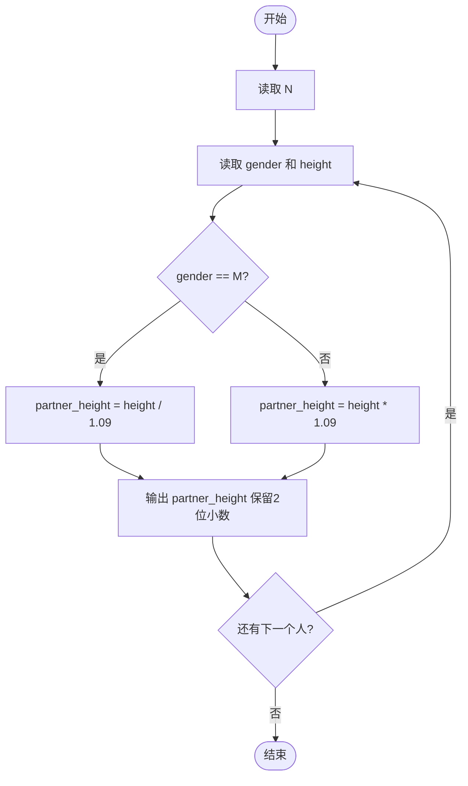
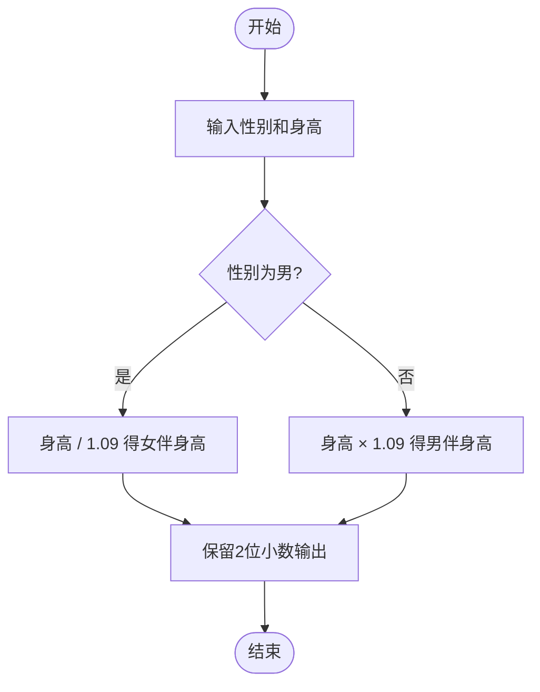

# L1-040 - 最佳情侣身高差（10 分）

- **时间限制**: 400 ms
- **内存限制**: 65536 KB
- **代码长度限制**: 16 KB

---

## 题目描述

专家通过多组情侣研究数据发现，最佳的情侣身高差遵循着一个公式：（女方的身高）$$\times$$1.09 =（男方的身高）。如果符合，你俩的身高差不管是牵手、拥抱、接吻，都是最和谐的差度。

下面就请你写个程序，为任意一位用户计算他/她的情侣的最佳身高。

### 输入格式:

输入第一行给出正整数$$N$$（$$\le 10$$），为前来查询的用户数。随后$$N$$行，每行按照“性别 身高”的格式给出前来查询的用户的性别和身高，其中“性别”为“F”表示女性、“M”表示男性；“身高”为区间 [1.0, 3.0] 之间的实数。

### 输出格式:

对每一个查询，在一行中为该用户计算出其情侣的最佳身高，保留小数点后2位。

### 输入样例:
```in
2
M 1.75
F 1.8
```

### 输出样例:
```out
1.61
1.96
```

## 示例

### 示例 1

**输入:**
```
2
M 1.75
F 1.8
```

**输出:**
```
1.61
1.96
```

---

## 题目详解

### 一、解题思路
本题要求根据公式计算最佳情侣身高。公式为：女方身高 × 1.09 = 男方身高。因此若用户为男性（M），最佳女伴身高 = 男方身高 / 1.09；若用户为女性（F），最佳男伴身高 = 女方身高 × 1.09。程序读取每个人的性别和身高后，根据性别选择对应公式计算，结果保留 2 位小数输出。

### 二、代码流程说明
1. 读取查询人数 N
2. 对每个人读取性别 `gender` 和身高 `height`
3. 判断性别：若 `gender == 'M'`，则 `partner_height = height / 1.09`；否则 `partner_height = height * 1.09`
4. 使用 `fixed << setprecision(2)` 格式化输出保留 2 位小数

### 三、代码流程图


### 四、解题流程图

