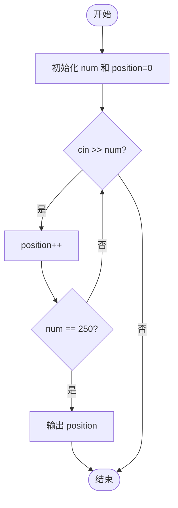
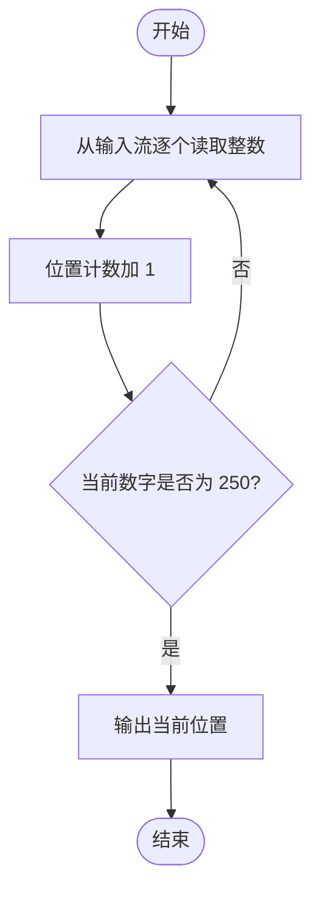

# L1-041 - 寻找250（10 分）

- **时间限制**: 400 ms
- **内存限制**: 65536 KB
- **代码长度限制**: 16 KB

---

## 题目描述


对方不想和你说话，并向你扔了一串数…… 而你必须从这一串数字中找到“250”这个高大上的感人数字。

### 输入格式:

输入在一行中给出不知道多少个绝对值不超过1000的整数，其中保证至少存在一个“250”。

### 输出格式:

在一行中输出第一次出现的“250”是对方扔过来的第几个数字（计数从1开始）。题目保证输出的数字在整型范围内。

### 输入样例:
```in
888 666 123 -233 250 13 250 -222
```

### 输出样例:
```out
5
```

## 示例

### 示例 1

**输入:**
```
888 666 123 -233 250 13 250 -222
```

**输出:**
```
5
```

---

## 题目详解

### 一、解题思路

从输入的一系列整数中查找第一次出现的 250 的位置。核心思路是使用 `while` 循环不断从标准输入读取整数，每读取一个数字就将位置计数器 `position` 加 1，当读到值为 250 的整数时，输出当前位置并通过 `break` 退出循环。

关键逻辑：
- 使用 `while (cin >> num)` 持续读取，直到所有整数读完
- 每读一个数 `position++`，实现从 1 开始的位置计数
- 条件判断 `num == 250`，命中后立即输出 `position` 并终止

### 二、代码流程说明

1. 定义整型变量 `num` 用于存储每次读取的整数，`position` 初始化为 0 用于记录位置
2. 进入 `while (cin >> num)` 循环，逐个读取整数
3. 每读取一个整数，`position` 自增 1
4. 判断 `num == 250` 是否成立
5. 若成立，输出 `position` 并 `break` 退出循环
6. 若不成立，继续读取下一个整数
7. 循环结束后程序返回 0

### 三、代码流程图



### 四、解题流程图


