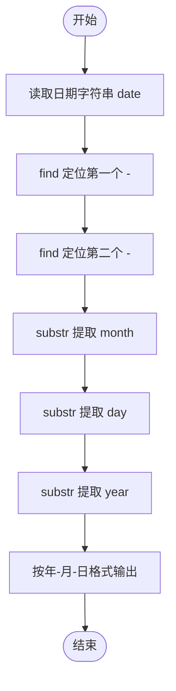
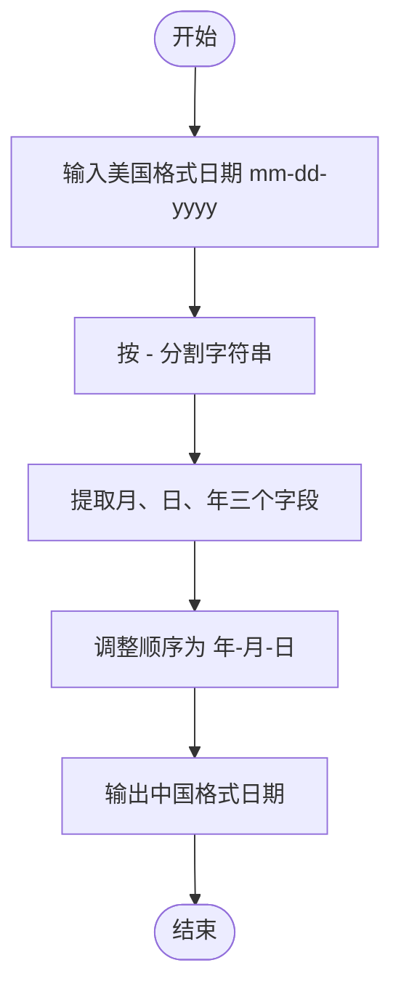

# L1-042 - 日期格式化（5 分）

- **时间限制**: 400 ms
- **内存限制**: 65536 KB
- **代码长度限制**: 16 KB

---

## 题目描述

世界上不同国家有不同的写日期的习惯。比如美国人习惯写成“月-日-年”，而中国人习惯写成“年-月-日”。下面请你写个程序，自动把读入的美国格式的日期改写成中国习惯的日期。

### 输入格式:

输入在一行中按照“mm-dd-yyyy”的格式给出月、日、年。题目保证给出的日期是1900年元旦至今合法的日期。

### 输出格式:

在一行中按照“yyyy-mm-dd”的格式给出年、月、日。

### 输入样例:
```in
03-15-2017
```

### 输出样例:
```out
2017-03-15
```

## 示例

### 示例 1

**输入:**
```
03-15-2017
```

**输出:**
```
2017-03-15
```

---

## 题目详解

### 一、解题思路

将美国格式日期（月-日-年，即 `mm-dd-yyyy`）转换为中国格式日期（年-月-日，即 `yyyy-mm-dd`）。核心思路是对字符串按 `-` 分隔符进行分割，提取出月、日、年三部分，再按新顺序重组输出。

关键步骤：
- 使用 `date.find('-')` 定位第一个分隔符位置，得到月份前的位置
- 使用 `date.find('-', first_dash + 1)` 定位第二个分隔符位置
- 通过 `substr` 分别提取 `month`、`day`、`year`
- 按 `year-month-day` 格式输出

### 二、代码流程说明

1. 定义字符串 `date`，从标准输入读取日期字符串
2. 使用 `date.find('-')` 找到第一个 `-` 的位置 `first_dash`
3. 使用 `date.find('-', first_dash + 1)` 找到第二个 `-` 的位置 `second_dash`
4. 通过 `date.substr(0, first_dash)` 提取月份 `month`
5. 通过 `date.substr(first_dash + 1, second_dash - first_dash - 1)` 提取日期 `day`
6. 通过 `date.substr(second_dash + 1)` 提取年份 `year`
7. 按 `year << "-" << month << "-" << day` 格式输出结果
8. 程序返回 0

### 三、代码流程图



### 四、解题流程图


