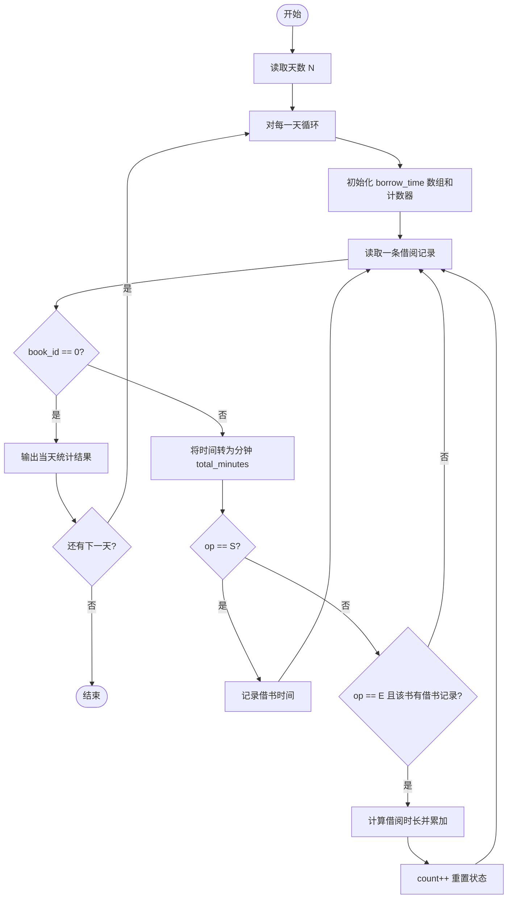
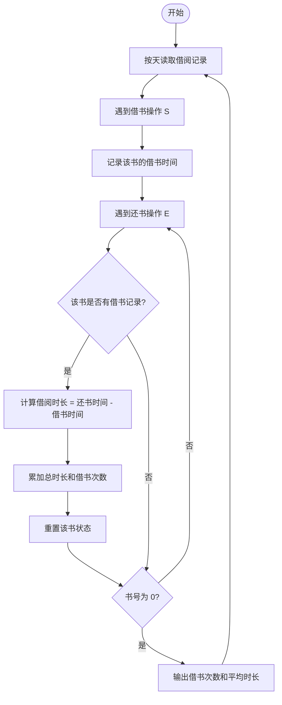

# L1-043 - 阅览室（20 分）

- **时间限制**: 400 ms
- **内存限制**: 65536 KB
- **代码长度限制**: 16 KB

---

## 题目描述

天梯图书阅览室请你编写一个简单的图书借阅统计程序。当读者借书时，管理员输入书号并按下`S`键，程序开始计时；当读者还书时，管理员输入书号并按下`E`键，程序结束计时。书号为不超过1000的正整数。当管理员将0作为书号输入时，表示一天工作结束，你的程序应输出当天的读者借书次数和平均阅读时间。

注意：由于线路偶尔会有故障，可能出现不完整的纪录，即只有`S`没有`E`，或者只有`E`没有`S`的纪录，系统应能自动忽略这种无效纪录。另外，题目保证书号是书的唯一标识，同一本书在任何时间区间内只可能被一位读者借阅。

### 输入格式:

输入在第一行给出一个正整数$$N$$（$$\le 10$$），随后给出$$N$$天的纪录。每天的纪录由若干次借阅操作组成，每次操作占一行，格式为：

`书号`（[1, 1000]内的整数） `键值`（`S`或`E`） `发生时间`（`hh:mm`，其中`hh`是[0,23]内的整数，`mm`是[0, 59]内整数）

每一天的纪录保证按时间递增的顺序给出。

### 输出格式:

对每天的纪录，在一行中输出当天的读者借书次数和平均阅读时间（以分钟为单位的精确到个位的整数时间）。

### 输入样例:
```in
3
1 S 08:10
2 S 08:35
1 E 10:00
2 E 13:16
0 S 17:00
0 S 17:00
3 E 08:10
1 S 08:20
2 S 09:00
1 E 09:20
0 E 17:00
```

### 输出样例:
```out
2 196
0 0
1 60
```

## 示例

### 示例 1

**输入:**
```
3
1 S 08:10
2 S 08:35
1 E 10:00
2 E 13:16
0 S 17:00
0 S 17:00
3 E 08:10
1 S 08:20
2 S 09:00
1 E 09:20
0 E 17:00
```

**输出:**
```
2 196
0 0
1 60
```

---

## 题目详解

### 一、解题思路

使用数组 `borrow_time` 记录每本书的借书时间（以分钟为单位），索引为书号。对每一天，读取若干条借阅操作记录：遇到 `S`（借书）操作时记录借书时间戳；遇到 `E`（还书）操作时，若该书有有效借书记录则计算借阅时长并累加。书号为 0 时表示一天结束，输出当天的借书次数和平均阅读时间。

关键逻辑：
- 将 `hh:mm` 格式时间转换为分钟数：`hh * 60 + mm`
- 还书时若 `borrow_time[book_id] != 0` 才是有效记录，否则忽略
- 平均时间采用四舍五入：`(total_time + count / 2) / count`
- 每次还书后将 `borrow_time[book_id]` 重置为 0

### 二、代码流程说明

1. 读取天数 `N`
2. 对每一天 `day` 循环，初始化 `borrow_time[1001]` 全零、`total_time = 0`、`count = 0`
3. 进入内层 `while(true)` 循环，读取 `book_id`、`op`、`time_str`
4. 若 `book_id == 0`，跳出内层循环
5. 将 `time_str` 拆分为小时和分钟，计算 `total_minutes`
6. 若 `op == 'S'`，将 `borrow_time[book_id]` 设为 `total_minutes`
7. 若 `op == 'E'` 且 `borrow_time[book_id] != 0`，计算 `duration` 并累加到 `total_time`，`count++`，重置 `borrow_time[book_id] = 0`
8. 一天结束后，若 `count == 0` 输出 `0 0`，否则计算平均时间并输出
9. 所有天数处理完毕，程序返回 0

### 三、代码流程图



### 四、解题流程图


