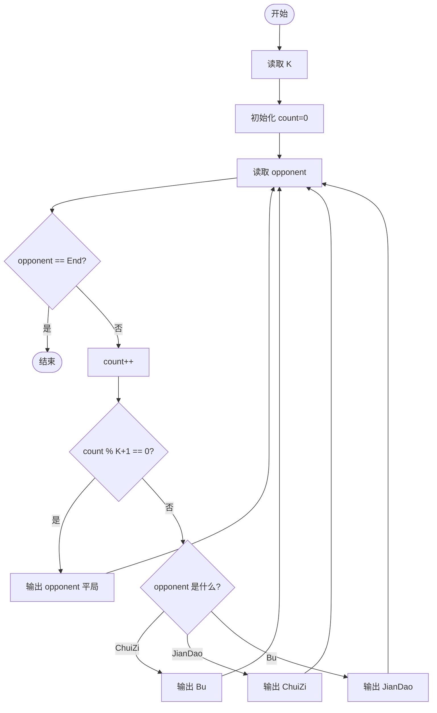
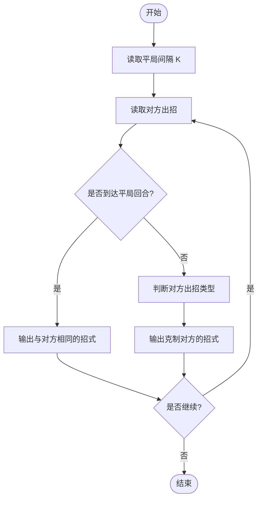

# L1-044 - 稳赢（15 分）

- **时间限制**: 400 ms
- **内存限制**: 65536 KB
- **代码长度限制**: 16 KB

---

## 题目描述

大家应该都会玩“锤子剪刀布”的游戏：两人同时给出手势，胜负规则如图所示：


现要求你编写一个稳赢不输的程序，根据对方的出招，给出对应的赢招。但是！为了不让对方输得太惨，你需要每隔$$K$$次就让一个平局。

### 输入格式:

输入首先在第一行给出正整数$$K$$（$$\le 10$$），即平局间隔的次数。随后每行给出对方的一次出招：`ChuiZi`代表“锤子”、`JianDao`代表“剪刀”、`Bu`代表“布”。`End`代表输入结束，这一行不要作为出招处理。

### 输出格式:

对每一个输入的出招，按要求输出稳赢或平局的招式。每招占一行。

### 输入样例:
```in
2
ChuiZi
JianDao
Bu
JianDao
Bu
ChuiZi
ChuiZi
End
```

### 输出样例:
```out
Bu
ChuiZi
Bu
ChuiZi
JianDao
ChuiZi
Bu
```

## 示例

### 示例 1

**输入:**
```
2
ChuiZi
JianDao
Bu
JianDao
Bu
ChuiZi
ChuiZi
End
```

**输出:**
```
Bu
ChuiZi
Bu
ChuiZi
JianDao
ChuiZi
Bu
```

---

## 题目详解

### 一、解题思路

这是一个锤子剪刀布游戏的"稳赢"程序。根据对方的出招，输出能必胜的招式，同时每隔 K 次输出一次平局。核心规则为：锤子(ChuiZi)赢剪刀(JianDao)、剪刀(JianDao)赢布(Bu)、布(Bu)赢锤子(ChuiZi)。必胜策略为输出能克制对方的招式（锤子→布、剪刀→锤子、布→剪刀）。每隔 K 次让一次平局即输出与对方相同的招式。

关键逻辑：
- 使用 `count % (K + 1) == 0` 判断是否为平局回合
- 胜招映射：ChuiZi → Bu，JianDao → ChuiZi，Bu → JianDao
- 遇到输入 `End` 时终止程序

### 二、代码流程说明

1. 读取整数 `K`，表示平局间隔次数
2. 初始化对战计数器 `count = 0`
3. 进入 `while(true)` 循环，读取对方出招字符串 `opponent`
4. 若 `opponent == "End"`，跳出循环
5. `count++`，记录当前是第几次对战
6. 判断 `count % (K + 1) == 0` 是否成立
7. 若成立（平局），直接输出 `opponent`
8. 若不成立（稳赢），根据 `opponent` 的值选择对应胜招输出：
   - `ChuiZi` → 输出 `Bu`
   - `JianDao` → 输出 `ChuiZi`
   - `Bu` → 输出 `JianDao`
9. 继续读取下一个出招
10. 程序返回 0

### 三、代码流程图



### 四、解题流程图


