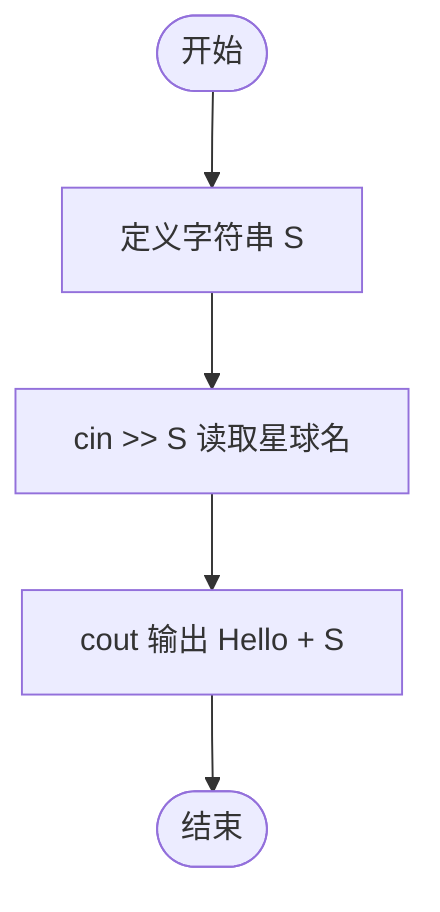
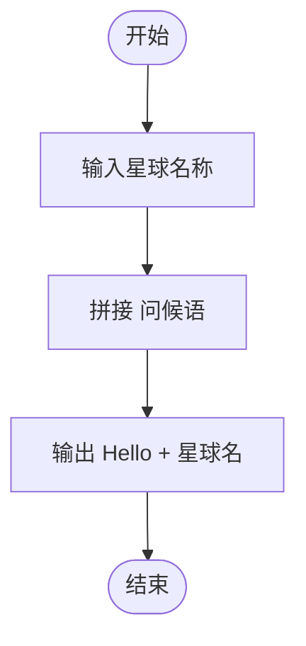

# L1-045 - 宇宙无敌大招呼（5 分）

- **时间限制**: 400 ms
- **内存限制**: 65536 KB
- **代码长度限制**: 16 KB

---

## 题目描述

据说所有程序员学习的第一个程序都是在屏幕上输出一句“Hello World”，跟这个世界打个招呼。作为天梯赛中的程序员，你写的程序得高级一点，要能跟任意指定的星球打招呼。

### 输入格式:

输入在第一行给出一个星球的名字`S`，是一个由不超过7个英文字母组成的单词，以回车结束。

### 输出格式:

在一行中输出`Hello S`，跟输入的`S`星球打个招呼。

### 输入样例:
```in
Mars
```

### 输出样例:
```out
Hello Mars
```

## 示例

### 示例 1

**输入:**
```
Mars
```

**输出:**
```
Hello Mars
```

---

## 题目详解

### 一、解题思路

这是一道最简单的字符串输入输出题。读取一个星球名称字符串 `S`，然后输出 `Hello S` 即可。使用 `cin` 读取字符串，使用 `cout` 输出拼接后的问候语。

关键逻辑：
- `cin >> S` 读取星球名称（不含空格的单词）
- `cout << "Hello " << S << endl` 输出问候语

### 二、代码流程说明

1. 定义字符串变量 `S`
2. 使用 `cin >> S` 从标准输入读取星球名称
3. 使用 `cout` 输出 `"Hello " << S << endl`
4. 程序返回 0

### 三、代码流程图



### 四、解题流程图


