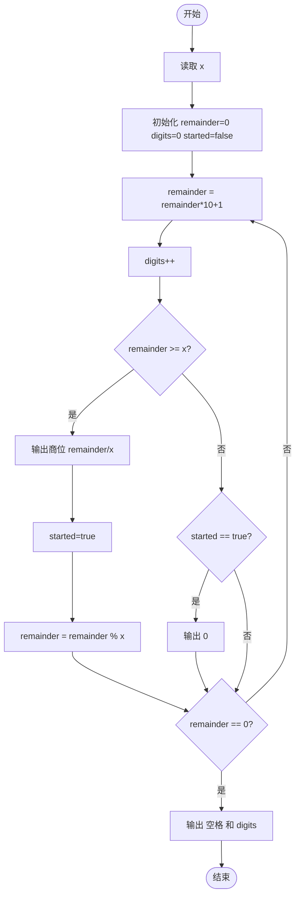
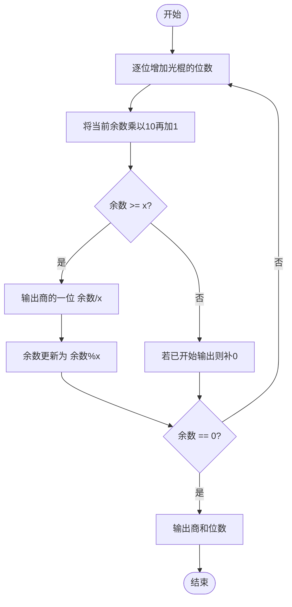

# L1-046 - 整除光棍（20 分）

- **时间限制**: 400 ms
- **内存限制**: 65536 KB
- **代码长度限制**: 16 KB

---

## 题目描述

这里所谓的“光棍”，并不是指单身汪啦~ 说的是全部由1组成的数字，比如1、11、111、1111等。传说任何一个光棍都能被一个不以5结尾的奇数整除。比如，111111就可以被13整除。 现在，你的程序要读入一个整数`x`，这个整数一定是奇数并且不以5结尾。然后，经过计算，输出两个数字：第一个数字`s`，表示`x`乘以`s`是一个光棍，第二个数字`n`是这个光棍的位数。这样的解当然不是唯一的,题目要求你输出最小的解。

提示：一个显然的办法是逐渐增加光棍的位数，直到可以整除`x`为止。但难点在于，`s`可能是个非常大的数 —— 比如，程序输入31，那么就输出3584229390681和15，因为31乘以3584229390681的结果是111111111111111，一共15个1。

### 输入格式:

输入在一行中给出一个不以5结尾的正奇数`x`（$$< 1000$$）。

### 输出格式:

在一行中输出相应的最小的`s`和`n`，其间以1个空格分隔。

### 输入样例:
```in
31
```

### 输出样例:
```out
3584229390681 15
```

## 示例

### 示例 1

**输入:**
```
31
```

**输出:**
```
3584229390681 15
```

---

## 题目详解

### 一、解题思路

这是一个典型的长除法模拟问题。需要找到最小的全 1 数（光棍）能被给定的奇数 `x` 整除。由于光棍可能极大（如输入 31 时结果有 15 位），无法直接用整数类型存储，因此采用模拟长除法的思路：从高位到低位逐位试商，避免处理超大数。

核心算法：
- 从 1 开始，逐位增加 1（`remainder = remainder * 10 + 1`）
- 当 `remainder >= x` 时，输出商的一位 `remainder / x`，余数更新为 `remainder % x`
- 当 `remainder < x` 但已经开始输出时，商中需要补 0
- 当余数为 0 时，说明找到能整除的光棍，输出商和位数

### 二、代码流程说明

1. 读取整数 `x`
2. 初始化 `remainder = 0`（当前余数）、`digits = 0`（光棍位数）、`started = false`（是否已开始输出商）
3. 进入 `while(true)` 循环：
4. `remainder = remainder * 10 + 1`，在余数基础上增加一位 1
5. `digits++`，位数加 1
6. 判断 `remainder >= x`：
   - 若是，输出 `remainder / x` 的商位，`started = true`，`remainder = remainder % x`
   - 若否且 `started == true`，输出 0（商的这一位为 0）
7. 判断 `remainder == 0`：
   - 若是，跳出循环
   - 若否，继续循环
8. 输出空格和 `digits`
9. 程序返回 0

### 三、代码流程图



### 四、解题流程图


