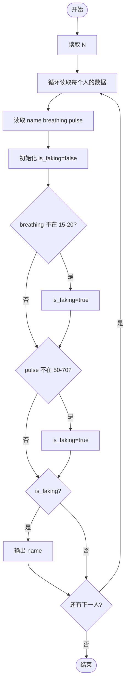
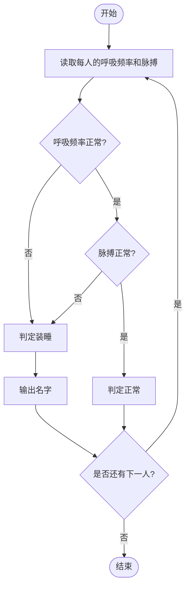

# L1-047 - 装睡（10 分）

- **时间限制**: 400 ms
- **内存限制**: 65536 KB
- **代码长度限制**: 16 KB

---

## 题目描述

你永远叫不醒一个装睡的人 —— 但是通过分析一个人的呼吸频率和脉搏，你可以发现谁在装睡！医生告诉我们，正常人睡眠时的呼吸频率是每分钟15-20次，脉搏是每分钟50-70次。下面给定一系列人的呼吸频率与脉搏，请你找出他们中间有可能在装睡的人，即至少一项指标不在正常范围内的人。

### 输入格式:

输入在第一行给出一个正整数$$N$$（$$\le 10$$）。随后$$N$$行，每行给出一个人的名字（仅由英文字母组成的、长度不超过3个字符的串）、其呼吸频率和脉搏（均为不超过100的正整数）。

### 输出格式:

按照输入顺序检查每个人，如果其至少一项指标不在正常范围内，则输出其名字，每个名字占一行。

### 输入样例:
```in
4
Amy 15 70
Tom 14 60
Joe 18 50
Zoe 21 71
```

### 输出样例:
```out
Tom
Zoe
```

## 示例

### 示例 1

**输入:**
```
4
Amy 15 70
Tom 14 60
Joe 18 50
Zoe 21 71
```

**输出:**
```
Tom
Zoe
```

---

## 题目详解

### 一、解题思路

根据每个人的呼吸频率和脉搏判断是否在"装睡"。正常人睡眠时呼吸频率为每分钟 15-20 次，脉搏为每分钟 50-70 次。如果某个人至少有一项指标不在正常范围内，则判定为装睡并输出其名字。

关键逻辑：
- 呼吸频率正常范围：`15 <= breathing <= 20`
- 脉搏正常范围：`50 <= pulse <= 70`
- 只要有一项不在范围内即判定装睡

### 二、代码流程说明

1. 读取人数 `N`
2. 进入 `for` 循环，对每个人进行检查
3. 读取 `name`、`breathing`、`pulse`
4. 初始化 `is_faking = false`
5. 判断 `breathing < 15 || breathing > 20`，若成立则 `is_faking = true`
6. 判断 `pulse < 50 || pulse > 70`，若成立则 `is_faking = true`
7. 若 `is_faking == true`，输出 `name`
8. 所有人检查完毕，程序返回 0

### 三、代码流程图



### 四、解题流程图


