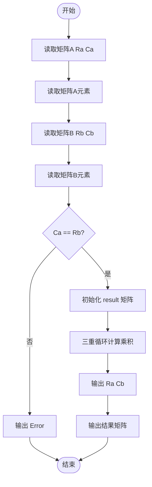
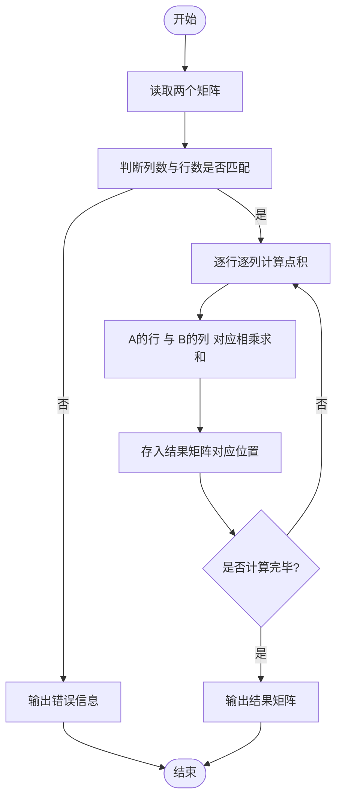

# L1-048 - 矩阵A乘以B（15 分）

- **时间限制**: 400 ms
- **内存限制**: 65536 KB
- **代码长度限制**: 16 KB

---

## 题目描述

给定两个矩阵$$A$$和$$B$$，要求你计算它们的乘积矩阵$$AB$$。需要注意的是，只有规模匹配的矩阵才可以相乘。即若$$A$$有$$R_a$$行、$$C_a$$列，$$B$$有$$R_b$$行、$$C_b$$列，则只有$$C_a$$与$$R_b$$相等时，两个矩阵才能相乘。

### 输入格式:

输入先后给出两个矩阵$$A$$和$$B$$。对于每个矩阵，首先在一行中给出其行数$$R$$和列数$$C$$，随后$$R$$行，每行给出$$C$$个整数，以1个空格分隔，且行首尾没有多余的空格。输入保证两个矩阵的$$R$$和$$C$$都是正数，并且所有整数的绝对值不超过100。

### 输出格式:

若输入的两个矩阵的规模是匹配的，则按照输入的格式输出乘积矩阵$$AB$$，否则输出`Error: Ca != Rb`，其中`Ca`是$$A$$的列数，`Rb`是$$B$$的行数。

### 输入样例 1：
```in
2 3
1 2 3
4 5 6
3 4
7 8 9 0
-1 -2 -3 -4
5 6 7 8
```

### 输出样例 1：
```out
2 4
20 22 24 16
53 58 63 28
```

### 输入样例 2：
```in
3 2
38 26
43 -5
0 17
3 2
-11 57
99 68
81 72
```

### 输出样例 2：
```out
Error: 2 != 3
```

## 示例

### 示例 1

**输入:**
```
2 3
1 2 3
4 5 6
3 4
7 8 9 0
-1 -2 -3 -4
5 6 7 8
```

**输出:**
```
2 4
20 22 24 16
53 58 63 28
```

### 示例 2

**输入:**
```
3 2
38 26
43 -5
0 17
3 2
-11 57
99 68
81 72
```

**输出:**
```
Error: 2 != 3
```

---

## 题目详解

### 一、解题思路

计算两个矩阵的乘积。矩阵乘法的规则为：若 A 是 Ra×Ca 矩阵，B 是 Rb×Cb 矩阵，则只有当 Ca == Rb 时才能相乘，结果矩阵为 Ra×Cb。结果矩阵中每个元素 `result[i][j]` 等于 A 的第 i 行与 B 的第 j 列对应元素乘积之和。

关键逻辑：
- 乘法条件：`Ca == Rb`
- 元素计算公式：`result[i][j] = Σ(A[i][k] * B[k][j])`，k 从 0 到 Ca-1
- 不匹配时输出 `Error: Ca != Rb`

### 二、代码流程说明

1. 读取矩阵 A 的行数 `Ra` 和列数 `Ca`
2. 使用双重循环读取矩阵 A 的元素到 `A[Ra][Ca]`
3. 读取矩阵 B 的行数 `Rb` 和列数 `Cb`
4. 使用双重循环读取矩阵 B 的元素到 `B[Rb][Cb]`
5. 判断 `Ca != Rb`：
   - 若是，输出 `Error: Ca != Rb` 并返回 0
6. 初始化结果矩阵 `result[Ra][Cb]` 全零
7. 使用三重循环计算矩阵乘积：`result[i][j] += A[i][k] * B[k][j]`
8. 输出结果矩阵的行数和列数
9. 使用双重循环输出结果矩阵，每行元素用空格分隔
10. 程序返回 0

### 三、代码流程图



### 四、解题流程图


