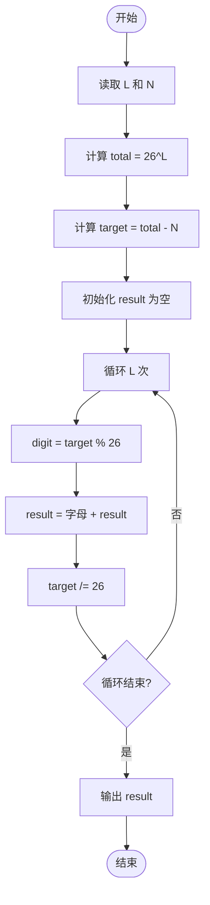
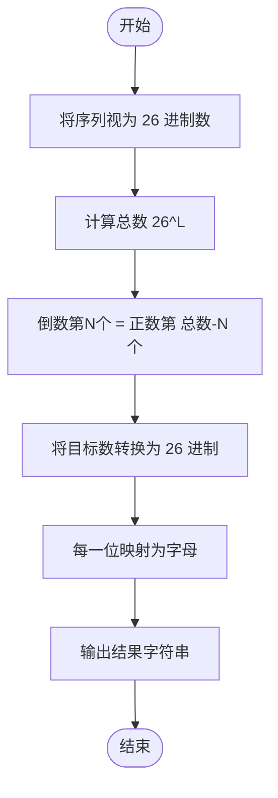

# L1-050 - 倒数第N个字符串（15 分）

- **时间限制**: 400 ms
- **内存限制**: 65536 KB
- **代码长度限制**: 16 KB

---

## 题目描述

给定一个完全由小写英文字母组成的字符串等差递增序列，该序列中的每个字符串的长度固定为 L，从 L 个 a 开始，以 1 为步长递增。例如当 L 为 3 时，序列为 { aaa, aab, aac, ..., aaz, aba, abb, ..., abz, ..., zzz }。这个序列的倒数第27个字符串就是 zyz。对于任意给定的 L，本题要求你给出对应序列倒数第 N 个字符串。

### 输入格式:

输入在一行中给出两个正整数 L（2 $$\le$$ L $$\le$$ 6）和 N（$$\le 10^5$$）。

### 输出格式:

在一行中输出对应序列倒数第 N 个字符串。题目保证这个字符串是存在的。

### 输入样例:
```in
3 7417
```

### 输出样例:
```out
pat
```

## 示例

### 示例 1

**输入:**
```
3 7417
```

**输出:**
```
pat
```

---

## 题目详解

### 一、解题思路

将字符串序列看作 26 进制数（a=0, b=1, ..., z=25）。长度为 L 的字符串共有 26^L 个，从 `aaa...a`（对应 0）到 `zzz...z`（对应 26^L - 1）。倒数第 N 个字符串就是正数第 `(26^L - N)` 个，将这个十进制数转换为 26 进制，每一位对应一个字母即可。

关键步骤：
- 计算总数 `total = 26^L`
- 目标位置 `target = total - N`
- 逐位提取 26 进制各位：`digit = target % 26`，对应字母 `'a' + digit`
- 从低位到高位依次拼接字符串

### 二、代码流程说明

1. 读取 `L` 和 `N`
2. 计算 `total = 26^L`（通过循环累乘）
3. 计算目标位置 `target = total - N`
4. 初始化结果字符串 `result`
5. 循环 L 次，每次：
   - `digit = target % 26`，取最低位
   - `result = char('a' + digit) + result`，将对应字母加到结果头部
   - `target /= 26`，去掉已处理的最低位
6. 输出 `result`
7. 程序返回 0

### 三、代码流程图



### 四、解题流程图


