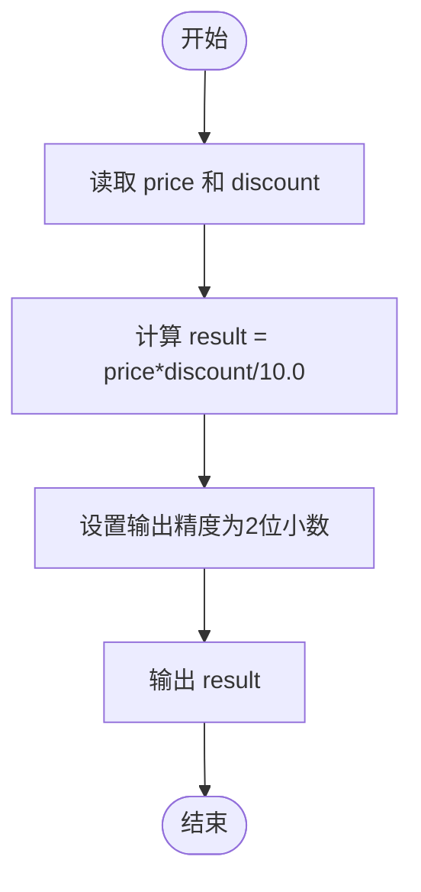
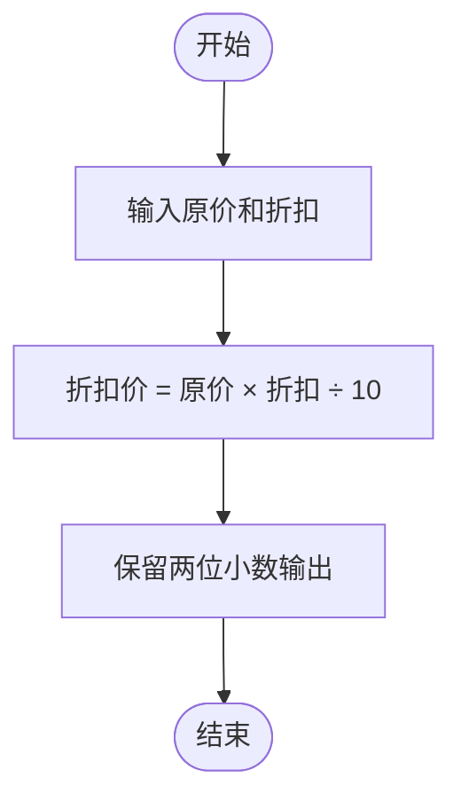

# L1-051 - 打折（5 分）

- **时间限制**: 400 ms
- **内存限制**: 65536 KB
- **代码长度限制**: 16 KB

---

## 题目描述

去商场淘打折商品时，计算打折以后的价钱是件颇费脑子的事情。例如原价 ￥988，标明打 7 折，则折扣价应该是 ￥988 x 70% = ￥691.60。本题就请你写个程序替客户计算折扣价。

### 输入格式:

输入在一行中给出商品的原价（不超过1万元的正整数）和折扣（为[1, 9]区间内的整数），其间以空格分隔。

### 输出格式:

在一行中输出商品的折扣价，保留小数点后 2 位。

### 输入样例:
```in
988 7
```

### 输出样例:
```out
691.60
```

## 示例

### 示例 1

**输入:**
```
988 7
```

**输出:**
```
691.60
```

---

## 题目详解

### 一、解题思路

根据商品原价和折扣计算折扣价。折扣价的计算公式为：`折扣价 = 原价 × 折扣 / 10`。例如原价 988 元打 7 折，即 `988 × 7 / 10 = 691.60`。需要注意使用浮点数运算，并以保留两位小数的格式输出。

关键逻辑：
- 公式：`result = price * discount / 10.0`
- 使用 `fixed << setprecision(2)` 控制输出精度

### 二、代码流程说明

1. 读取原价 `price` 和折扣 `discount`
2. 计算折扣价：`result = price * discount / 10.0`
3. 使用 `fixed << setprecision(2)` 设置输出格式
4. 输出 `result`
5. 程序返回 0

### 三、代码流程图



### 四、解题流程图


