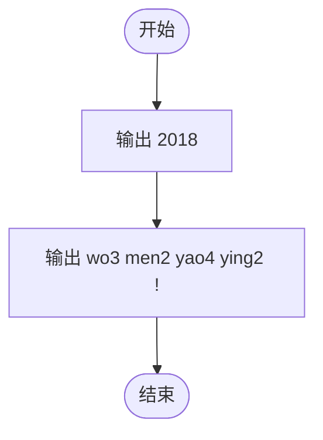
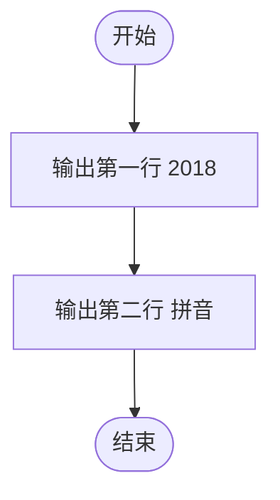

# L1-052 - 2018我们要赢（5 分）

- **时间限制**: 400 ms
- **内存限制**: 65536 KB
- **代码长度限制**: 16 KB

---

## 题目描述

2018年天梯赛的注册邀请码是“2018wmyy”，意思就是“2018我们要赢”。本题就请你用汉语拼音输出这句话。

### 输入格式:

本题没有输入。

### 输出格式:

在第一行中输出：“2018”；第二行中输出：“wo3 men2 yao4 ying2 !”。

### 输入样例:
```in
无
```

### 输出样例:
```out
2018
wo3 men2 yao4 ying2 !
```

## 示例

### 示例 1

**输入:**
```
无
```

**输出:**
```
2018
wo3 men2 yao4 ying2 !
```

---

## 题目详解

### 一、解题思路

这是一道最简单的无输入输出题。直接按要求输出两行内容即可：第一行为 `2018`，第二行为汉语拼音 `wo3 men2 yao4 ying2 !`。

关键逻辑：
- 无输入处理
- 按顺序输出两行固定内容

### 二、代码流程说明

1. 使用 `cout` 输出第一行 `2018` 并换行
2. 使用 `cout` 输出第二行 `wo3 men2 yao4 ying2 !` 并换行
3. 程序返回 0

### 三、代码流程图



### 四、解题流程图


