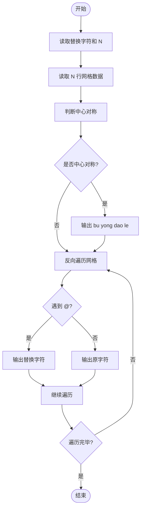
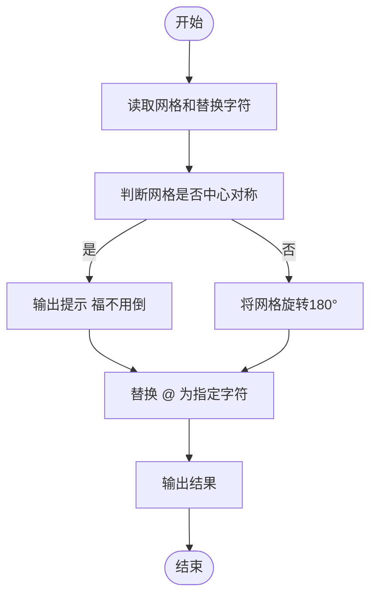

# L1-054 - 福到了（15 分）

- **时间限制**: 400 ms
- **内存限制**: 65536 KB
- **代码长度限制**: 16 KB

---

## 题目描述

“福”字倒着贴，寓意“福到”。不论到底算不算民俗，本题且请你编写程序，把各种汉字倒过来输出。这里要处理的每个汉字是由一个 N $$\times$$ N 的网格组成的，网格中的元素或者为字符 `@` 或者为空格。而倒过来的汉字所用的字符由裁判指定。

### 输入格式:

输入在第一行中给出倒过来的汉字所用的字符、以及网格的规模 N （不超过100的正整数），其间以 1 个空格分隔；随后 N 行，每行给出 N 个字符，或者为 `@` 或者为空格。

### 输出格式:

输出倒置的网格，如样例所示。但是，如果这个字正过来倒过去是一样的，就先输出`bu yong dao le`，然后再用输入指定的字符将其输出。

### 输入样例 1：
```in
$ 9
 @  @@@@@
@@@  @@@ 
 @   @ @ 
@@@  @@@ 
@@@ @@@@@
@@@ @ @ @
@@@ @@@@@
 @  @ @ @
 @  @@@@@
```

### 输出样例 1：
```out
$$$$$  $ 
$ $ $  $ 
$$$$$ $$$
$ $ $ $$$
$$$$$ $$$
 $$$  $$$
 $ $   $ 
 $$$  $$$
$$$$$  $
```

### 输入样例 2：
```in
& 3
@@@
 @ 
@@@
```

### 输出样例 2：
```out
bu yong dao le
&&&
 & 
&&&
```

## 示例

### 示例 1

**输入:**
```
$ 9
 @  @@@@@
@@@  @@@ 
 @   @ @ 
@@@  @@@ 
@@@ @@@@@
@@@ @ @ @
@@@ @@@@@
 @  @ @ @
 @  @@@@@
```

**输出:**
```
$$$$$  $ 
$ $ $  $ 
$$$$$ $$$
$ $ $ $$$
$$$$$ $$$
 $$$  $$$
 $ $   $ 
 $$$  $$$
$$$$$  $
```

### 示例 2

**输入:**
```
& 3
@@@
 @ 
@@@
```

**输出:**
```
bu yong dao le
&&&
 & 
&&&
```

---

## 题目详解

### 一、解题思路

将 N×N 网格表示的汉字倒置输出（中心对称旋转 180°），并将网格中的 `@` 替换为指定字符。如果一个网格正过来倒过去一样（即中心对称），则不需要倒置，直接替换输出即可。

核心逻辑：
- 中心对称判断：`grid[i][j]` 应等于 `grid[N-1-i][N-1-j]`
- 倒置（旋转 180°）即中心对称反转：遍历顺序从 `(N-1, N-1)` 到 `(0, 0)`
- 替换：遇到 `@` 输出指定字符，否则输出原字符

### 二、代码流程说明

1. 读取替换字符 `replace_char` 和网格规模 `N`
2. 使用 `getline` 读取 N 行网格数据存入 `grid[]`
3. 遍历整个网格，判断是否中心对称：
   - 比较 `grid[i][j]` 与 `grid[N-1-i][N-1-j]`
   - 若任何一对不相等，`is_symmetric = false` 并跳出
4. 若 `is_symmetric == true`，输出 `bu yong dao le`
5. 反向遍历网格（从 `i=N-1` 到 `0`，`j=N-1` 到 `0`）：
   - 遇到 `@` 输出 `replace_char`
   - 否则输出原字符
   - 每行结束后换行
6. 程序返回 0

### 三、代码流程图



### 四、解题流程图


