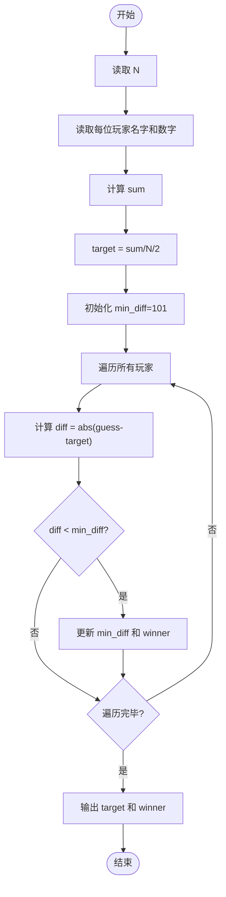
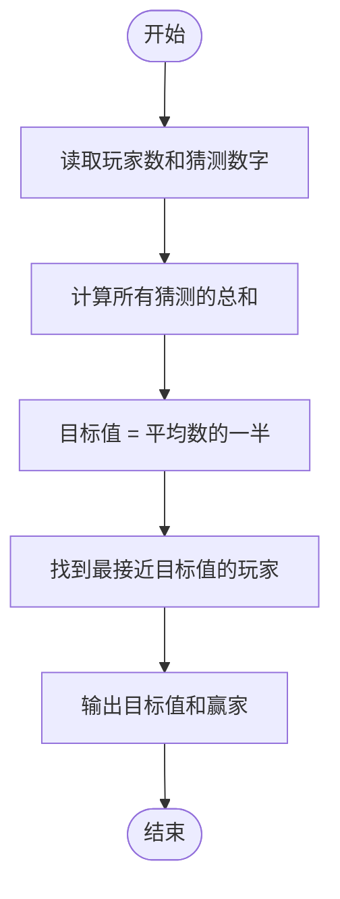

# L1-056 - 猜数字（20 分）

- **时间限制**: 400 ms
- **内存限制**: 65536 KB
- **代码长度限制**: 16 KB

---

## 题目描述

一群人坐在一起，每人猜一个 100 以内的数，谁的数字最接近大家平均数的一半就赢。本题就要求你找出其中的赢家。

### 输入格式:

输入在第一行给出一个正整数N（$$\le 10^4$$）。随后 N 行，每行给出一个玩家的名字（由不超过8个英文字母组成的字符串）和其猜的正整数（$$\le$$ 100）。

### 输出格式:

在一行中顺序输出：大家平均数的一半（只输出整数部分）、赢家的名字，其间以空格分隔。题目保证赢家是唯一的。

### 输入样例:
```in
7
Bob 35
Amy 28
James 98
Alice 11
Jack 45
Smith 33
Chris 62
```

### 输出样例:
```out
22 Amy
```

## 示例

### 示例 1

**输入:**
```
7
Bob 35
Amy 28
James 98
Alice 11
Jack 45
Smith 33
Chris 62
```

**输出:**
```
22 Amy
```

---

## 题目详解

### 一、解题思路

计算所有玩家猜测数字的平均数的一半（取整数部分）作为目标值，然后找到猜测数字最接近该目标值的玩家。目标值公式为 `target = sum / N / 2`，其中 `sum` 为所有猜测数字之和，`N` 为玩家人数。

关键逻辑：
- 目标值：`target = sum / N / 2`（整数除法自动截断）
- 遍历所有玩家，计算 `abs(guesses[i] - target)` 找到差值最小的
- 使用 `min_diff` 跟踪最小差值，对应玩家即为赢家

### 二、代码流程说明

1. 读取玩家人数 `N`
2. 读取每位玩家的名字 `names[i]` 和猜测数字 `guesses[i]`，同时累加 `sum`
3. 计算目标值 `target = sum / N / 2`
4. 初始化 `min_diff = 101`（猜测数字最大为 100）
5. 遍历所有玩家：
   - 计算 `diff = abs(guesses[i] - target)`
   - 若 `diff < min_diff`，更新 `min_diff` 和 `winner`
6. 输出 `target` 和 `winner`
7. 程序返回 0

### 三、代码流程图



### 四、解题流程图


