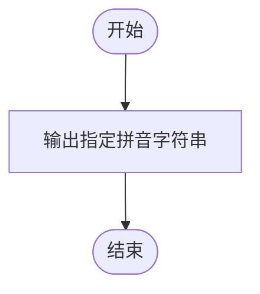
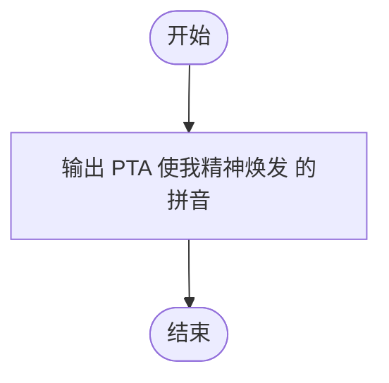

# L1-057 - PTA使我精神焕发（5 分）

- **时间限制**: 400 ms
- **内存限制**: 65536 KB
- **代码长度限制**: 16 KB

---

## 题目描述


以上是湖北经济学院同学的大作。本题就请你用汉语拼音输出这句话。

### 输入格式:

本题没有输入。

### 输出格式:

在一行中按照样例输出，以惊叹号结尾。

### 输入样例:
```in
无
```

### 输出样例:
```out
PTA shi3 wo3 jing1 shen2 huan4 fa1 !
```

## 示例

### 示例 1

**输入:**
```
无
```

**输出:**
```
PTA shi3 wo3 jing1 shen2 huan4 fa1 !
```

---

## 题目详解

### 一、解题思路

这是一道简单的无输入输出题。按要求输出一行固定的拼音字符串 `PTA shi3 wo3 jing1 shen2 huan4 fa1 !`，以惊叹号结尾。

关键逻辑：
- 无输入处理
- 直接 `cout` 输出指定字符串

### 二、代码流程说明

1. 使用 `cout` 输出 `PTA shi3 wo3 jing1 shen2 huan4 fa1 !` 并换行
2. 程序返回 0

### 三、代码流程图



### 四、解题流程图


