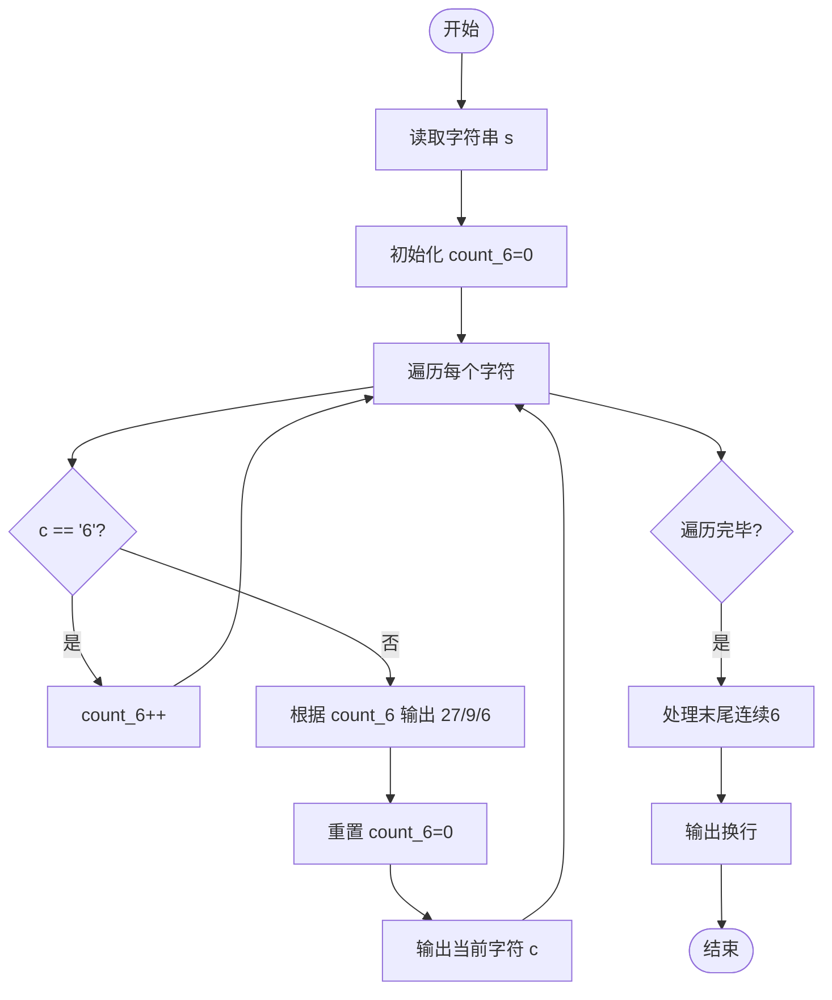
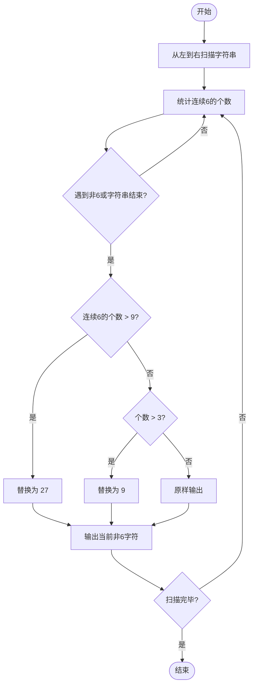

# L1-058 - 6翻了（15 分）

- **时间限制**: 400 ms
- **内存限制**: 65536 KB
- **代码长度限制**: 16 KB

---

## 题目描述


“666”是一种网络用语，大概是表示某人很厉害、我们很佩服的意思。最近又衍生出另一个数字“9”，意思是“6翻了”，实在太厉害的意思。如果你以为这就是厉害的最高境界，那就错啦 —— 目前的最高境界是数字“27”，因为这是 3 个 “9”！

本题就请你编写程序，将那些过时的、只会用一连串“6666……6”表达仰慕的句子，翻译成最新的高级表达。

### 输入格式:

输入在一行中给出一句话，即一个非空字符串，由不超过 1000 个英文字母、数字和空格组成，以回车结束。

### 输出格式:

从左到右扫描输入的句子：如果句子中有超过 3 个连续的 6，则将这串连续的 6 替换成 9；但如果有超过 9 个连续的 6，则将这串连续的 6 替换成 27。其他内容不受影响，原样输出。

### 输入样例:
```in
it is so 666 really 6666 what else can I say 6666666666
```

### 输出样例:
```out
it is so 666 really 9 what else can I say 27
```

## 示例

### 示例 1

**输入:**
```
it is so 666 really 6666 what else can I say 6666666666
```

**输出:**
```
it is so 666 really 9 what else can I say 27
```

---

## 题目详解

### 一、解题思路

从左到右扫描输入字符串，识别连续的 `6` 序列并根据长度进行替换：超过 9 个连续 `6` 替换为 `27`，超过 3 个（但不超过 9 个）连续 `6` 替换为 `9`，3 个及以下保持原样。其他字符不受影响原样输出。

关键逻辑：
- 使用 `count_6` 统计连续 `6` 的个数
- 遇到非 `6` 字符时处理之前累计的 `6` 序列
- 字符串末尾的 `6` 序列需要单独处理

### 二、代码流程说明

1. 使用 `getline` 读取整行字符串 `s`
2. 初始化 `count_6 = 0`
3. 遍历字符串中每个字符 `c`：
   - 若 `c == '6'`，`count_6++`
   - 否则：根据 `count_6` 的值输出对应结果（`27`/`9`/原 `6`），重置 `count_6 = 0`，然后输出当前字符 `c`
4. 循环结束后处理末尾的连续 `6`
5. 输出换行符，程序返回 0

### 三、代码流程图



### 四、解题流程图


