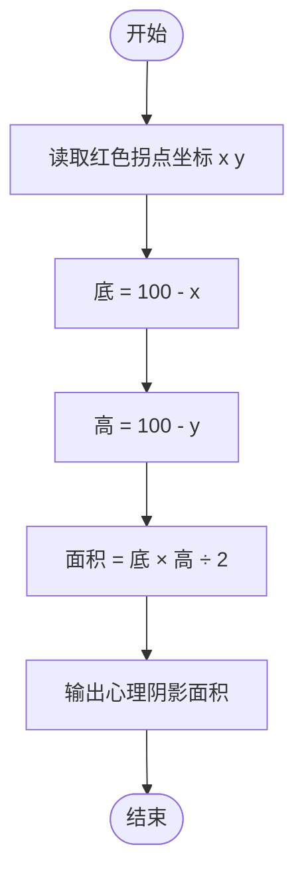

# L1-060 - 心理阴影面积（5 分）

- **时间限制**: 400 ms
- **内存限制**: 65536 KB
- **代码长度限制**: 16 KB

---

## 题目描述


这是一幅心理阴影面积图。我们都以为自己可以匀速前进（图中蓝色直线），而拖延症晚期的我们往往执行的是最后时刻的疯狂赶工（图中的红色折线）。由红、蓝线围出的面积，就是我们在做作业时的心理阴影面积。

现给出红色拐点的坐标 $$(x,y)$$，要求你算出这个心理阴影面积。

### 输入格式:

输入在一行中给出 2 个不超过 100 的正整数 $$x$$ 和 $$y$$，并且保证有 $$x>y$$。这里假设横、纵坐标的最大值（即截止日和最终完成度）都是 100。

### 输出格式:

在一行中输出心理阴影面积。

友情提醒：三角形的面积 = 底边长 x 高 / 2；矩形面积 = 底边长 x 高。嫑想得太复杂，这是一道 5 分考减法的题……

### 输入样例:
```in
90 10
```

### 输出样例:
```out
4000
```

## 示例

### 示例 1

**输入:**
```
90 10
```

**输出:**
```
4000
```

---

## 题目详解

### 一、解题思路

计算心理阴影面积，即红蓝两条线围出的三角形面积。蓝线是从 (0,0) 到 (100,100) 的对角线，红线是从 (0,0) 经拐点 (x,y) 到 (100,100) 的折线。阴影部分是一个直角三角形，底边长为 `(100 - x)`，高为 `(100 - y)`，面积公式为 `面积 = 底 × 高 / 2`。

关键逻辑：
- 三角形面积公式：`area = (100 - x) * (100 - y) / 2`
- 输入保证 `x > y`，所以结果为正

### 二、代码流程说明

1. 读取拐点坐标 `x` 和 `y`
2. 计算阴影面积 `area = (100 - x) * (100 - y) / 2`
3. 输出 `area`
4. 程序返回 0

### 三、代码流程图

```mermaid
flowchart TD
    A([开始]) --> B[读取 x 和 y]
    B --> C[计算 area = (100-x)*(100-y)/2]
    C --> D[输出 area]
    D --> E([结束])
```

### 四、解题流程图


