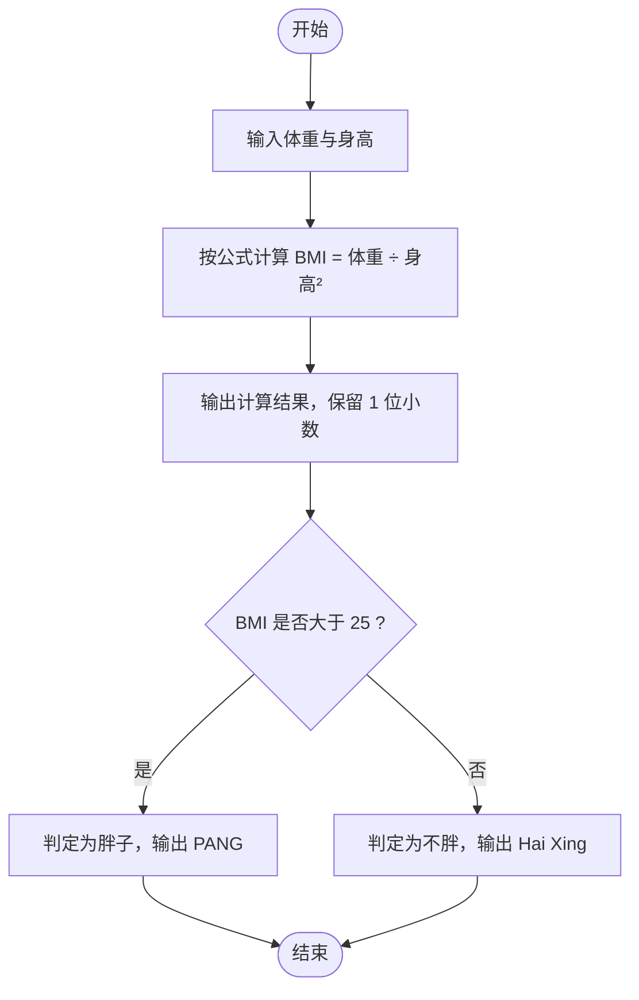

# L1-061 - 新胖子公式（10 分）

- **时间限制**: 400 ms
- **内存限制**: 65536 KB
- **代码长度限制**: 16 KB

---

## 题目描述

根据钱江晚报官方微博的报导，最新的肥胖计算方法为：体重(kg) / 身高(m) 的平方。如果超过 25，你就是胖子。于是本题就请你编写程序自动判断一个人到底算不算胖子。

### 输入格式:

输入在一行中给出两个正数，依次为一个人的体重（以 kg 为单位）和身高（以 m 为单位），其间以空格分隔。其中体重不超过 1000 kg，身高不超过 3.0 m。

### 输出格式:

首先输出将该人的体重和身高代入肥胖公式的计算结果，保留小数点后 1 位。如果这个数值大于 25，就在第二行输出 `PANG`，否则输出 `Hai Xing`。

### 输入样例 1：
```in
100.1 1.74
```

### 输出样例 1：
```out
33.1
PANG
```

### 输入样例 2：
```in
65 1.70
```

### 输出样例 2：
```out
22.5
Hai Xing
```

## 示例

### 示例 1

**输入:**
```
100.1 1.74
```

**输出:**
```
33.1
PANG
```

### 示例 2

**输入:**
```
65 1.70
```

**输出:**
```
22.5
Hai Xing
```

---

## 题目详解

### 一、解题思路

题目给出的最新肥胖计算方法是 BMI 公式：

```
BMI = 体重(kg) / 身高(m)²
```

解题步骤：

1. 读入体重 `weight`（kg）和身高 `height`（m）。
2. 代入公式计算 `bmi = weight / (height * height)`。
3. 按格式输出 BMI 值，保留 1 位小数。
4. 判断：若 `bmi > 25` 判定为胖子，输出 `PANG`；否则输出 `Hai Xing`。

注意：题目输出样例 1 为 `100.1 1.74` 算出 `33.1`，说明身高单位必须用米，且体重与身高均为浮点数，需用 `double` 存储，避免整数除法丢失精度。

### 二、代码流程说明

1. 定义 `double` 类型变量 `weight`、`height`，用 `cin` 读入体重和身高。
2. 计算肥胖指数 `bmi = weight / (height * height)`。
3. 使用 `cout << fixed << setprecision(1) << bmi` 输出 BMI 值，`fixed` 配合 `setprecision(1)` 保证输出保留 1 位小数。
4. 用 `if (bmi > 25)` 判断：条件成立输出 `PANG`，否则输出 `Hai Xing`，随后 `return 0` 结束程序。

### 三、代码流程图

```mermaid
flowchart TD
    A([开始]) --> B[读取体重 weight 和身高 height]
    B --> C[计算 bmi = weight / (height * height)]
    C --> D[输出 BMI 值，保留 1 位小数]
    D --> E{bmi > 25 ?}
    E -- 是 --> F[输出 PANG]
    E -- 否 --> G[输出 Hai Xing]
    F --> H([结束])
    G --> H
```

### 四、解题流程图


